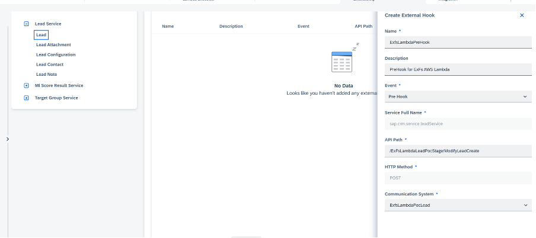

# Determinations via External hooks

External API hooks provide the option where customers can implement custom validations & determinations externally.

Please refer [here](https://pages.github.tools.sap/elsa/sap-n.docs/docs/architecture/extensibility/offngap/customlogic/customlogicexternalhooks/) for details on external hooks and how it can be configured.

We have implemented determination in our service.

### Determination Scenario:
If any user is changing the name of Lead, then we are determining and updating name accordingly as provided in AWS Lambda Function.

To achieve this, follow these steps:
* Create your IAM Root User in AWS console.
* Assuming user is created, login to AWS Console with valid user credentials.
* Create an AWS Lambda Function for performing determination using Lambda service provided in AWS console for a specific region. How to Configure Lambda function is provided [here](https://docs.aws.amazon.com/lambda/)
* Create an API using API Gateway Service provided in AWS console for a specific region same as that of Lambda’s. API can be of type HTTP or REST API. How to create API Gateway is provided [here](https://docs.aws.amazon.com/apigateway/?icmpid=docs_homepage_networking)
* Once API is created and determination/validation logic is written, create communication system in SAP Sales and Service Cloud
    * Enter DisplayID.
    * Choose outbound configuration.
    * Give Host Name. Host Name is the API domain which you can get from URL of API created via AWS API Gateway. For example: https://www.sampleDomain.com.
    * In authentication Method, enter “OAuth 2.0 Client Credentials”. 
    * Enter ClientID, Client Secret, Token URL. How to get these is explained in step- "OAuth 2.0 Client credentials setup".
    * Save to see that communication system is activated.
* Once this is done, configure external hooks for entity. For this reference implementation, we need to enable for "Lead" entity. To enable, go to user menu->settings-> extensibility Administration-> Lead Service-> Lead. Under external hooks tab, create External hooks. Enter below details:
     * Name
     * Description
     * Event - Pre Hook (since this is relevant for our determination scenario) / Post Hook (For Determination of extension fields or for Validations)
     * API Path - relative path of API created via AWS API Gateway
     * Communication system, which was created in previous step.

Refer below screenshot as well: 

### OAuth 2.0 Client credentials setup:

* Create Lambda function for authenticating OAuth credentials.
* Add that lambda function as Lambda Authorizer from AWS API Gateway -> Authorizers.

 
