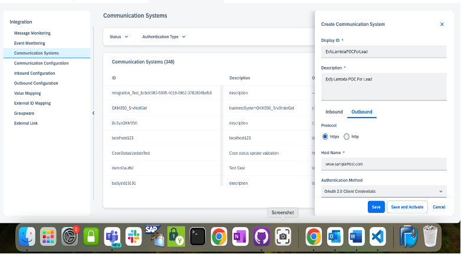
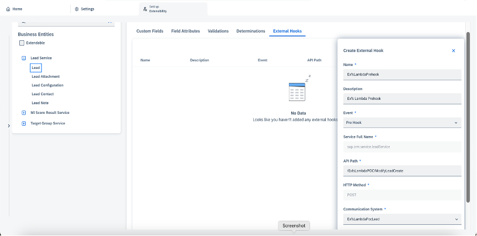

### Configurations in SAP Sales and Service Cloud
There are some configurations that needs to be done in SAP Sales and Service Cloud.
* Create a communication system in Admin Settings “Integration -> Communication Systems”. Please refer below screenshot. Here host name is the domain of API created in AWS API Gateway.

* Create an External hook (prehook for determinations on standard/Extension fields or post hook for determination on extension fields/validations). This has to be created in Admin Settings “Extensibility -> Extensibility Administration -> Lead Service -> Lead(We are using lead our reference scenario). Here API Path is relative path in API created via API GATEWAY Service. Please refer below screenshot:

* In reference scenario, when Lead Name is maintained as “Lead low priority” and qualification as “Cold” while creating a Lead and when sales executive wants to change qualification to “Hot” so that name of the Lead can automatically set to “Lead high priority”.