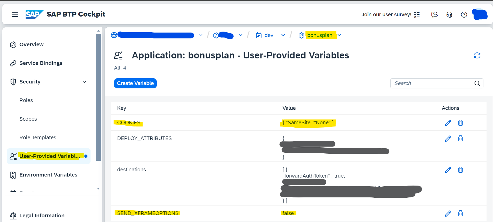
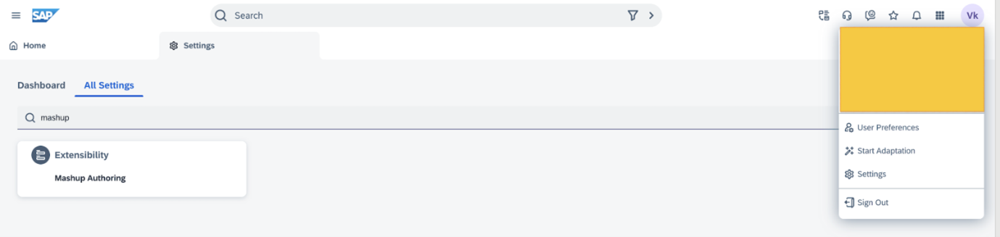
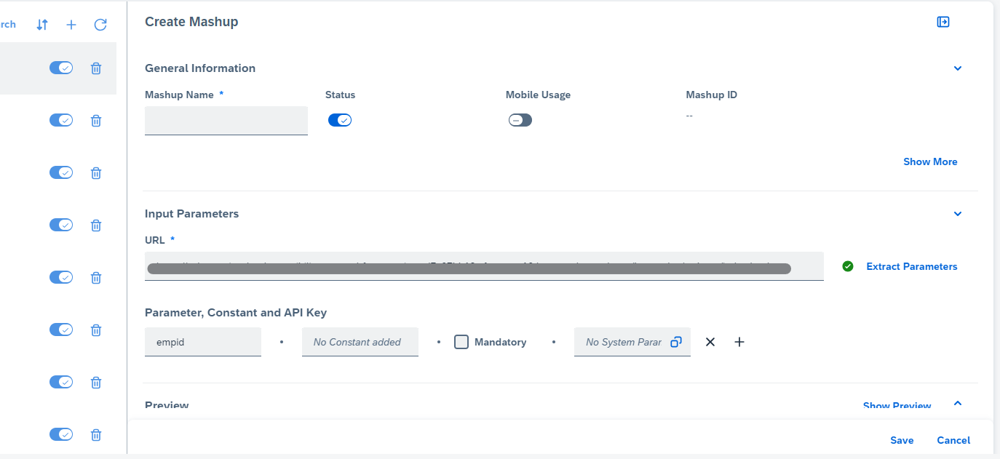
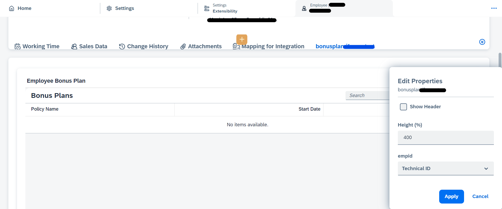

# Embed UI application via mashup
As per our scenario, employee can see his/her bonus in employee object details of SAP Sales and Service Cloud application. We will use mashup capabilities for embedding. To acheive this, please follow the steps mentioned below:
### BTP configuration
Since we are loading this application in mashup, which in turn loads it in iframe, our application(bonus plan) needs to support it, means our application should be allowed to be loaded in iFrame. For that, we need to do some configuration as below:
* Go to BTP account and navigate to space.Since application is deployed, so under application menu "bonusplan" application will be available.
    
* Go to "bonusplan" applicaiton and set highlighhted variables in "User Provided Variables" according to the image

    

### Add bonus plan application UI in SAP Sales and Service Cloud via mashup
**Step 1:** Go to SAP Sales and Service Cloud  

**Step 2:** From user settings, navigate to "Mashup Authoring" and create a new url mashup. 
 

 **Step 3:** In the URL field of the mashup, add the employee view url ([application-url]/bonusplan/webapp/index.html). Also, add a parameter, "empid". Save the mashup. 

**Step 4:** Go to user settings, search and open Employees-> select any employee -> click on start adaptation from user menu.

**Step 5:** Add a new tab via adapatation and add the mashup created in step 3. Map the mashup parameter empid to Technical Id. "Technical Id" is uuid of employee in SAP Sales and Service Cloud.
 

Now Employee can see their assigned Bonus Plans in this newly created tab. 

Please note: The logged-in user can see his own Bonus Plan only, and can't see any other employee's bonusplan if he is not admin. 
