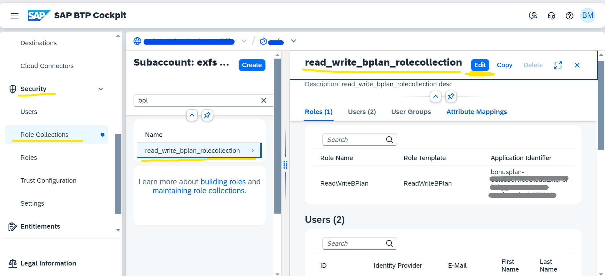

## Adding Authorization

Once [authentication](./authentication.md) is added we need to add restriction to the resources based on role based user access. Scopes, roles and role-collections are needed for the same.

### Create scopes, roles and role-collections for the application 

We can create it using mta.yaml or xs-security.json or even directly in BTP. 

In our reference application (bonusplan) we have created it using xs-security.json

Below is a sample of settings to create scopes, role-templates and role-collection. Please note these role-collection will be assigned to the BTP user we created in [authentication](./authentication.md) step. 

For more details on Scope, Roles etc, Please follow below links
* https://cap.cloud.sap/docs/guides/security/authorization#_1-roles-and-attributes-are-filled-into-the-xsuaa-configuration

* https://help.sap.com/docs/btp/sap-business-technology-platform/create-role-collections-with-predefined-roles

* https://help.sap.com/docs/hana-cloud-database/sap-hana-cloud-sap-hana-database-developer-guide-for-cloud-foundry-multitarget-applications-sap-web-ide-full-stack/application-security-descriptor-configuration-syntax?version=2024_2_QRC

### Protect services using authorization
There are many ways to add restriction to a resource. We have used Role as restriction criteria in our sample applicaiton. According to our sample a user must have highlighted role to access service endpoints shown in image. 

For more details on adding restriction on resources, please follow below links 
* https://cap.cloud.sap/docs/guides/security/authorization#design-authorization-models-from-the-start
* https://help.sap.com/docs/btp/sap-business-technology-platform/adding-authentication-and-authorization?version=Cloud

* https://help.sap.com/docs/hana-cloud-database/sap-hana-cloud-sap-hana-database-developer-guide-for-cloud-foundry-multitarget-applications-sap-web-ide-full-stack/maintaining-application-security-in-cloud-foundry-on-sap-btp?version=2024_2_QRC

**Note:** New Scopes, Roles and Role-collection can be created as per requirement by following same process.

## Assign role to BTP user 

Once the scopes, Roles and role-collections are added, we need to assign proper roles to the respective BTP users. 

Follow below process on how to add user to role-collection ([know more about role-collection](https://help.sap.com/docs/btp/sap-business-technology-platform/create-role-collections-with-predefined-roles)), in order to provide role to the user-
* Go to BTP and navigate to subaccount
* Open Security and then Role Collections
* Search and open your created Role collection.
* Click on Edit button and add user in users section and save it.

## Authorization details as per this sample applicaiton (BonusPlan)
Authorization is implemented in this application. As explained in reference scenario, we have 2 roles/personas- Admin and Employee. For Admin users, role collection -**read_write_bplan_rolecollection** needs to be assigned.
If this role is not assigned, user is treated as employee means user has employee persona.

Follow steps below to add authorization:

* Go to your BTP sub account > Security, and click on "Role Collections"
* Search and open "read_write_bplan_rolecollection" Role collection. This role should be there after deployment of application, as its created via code.  

    

* Click on Edit button and add user in users section and save it.

Now user is added to proper role, hence the user can now access the service endpoints restricted by the same role.
