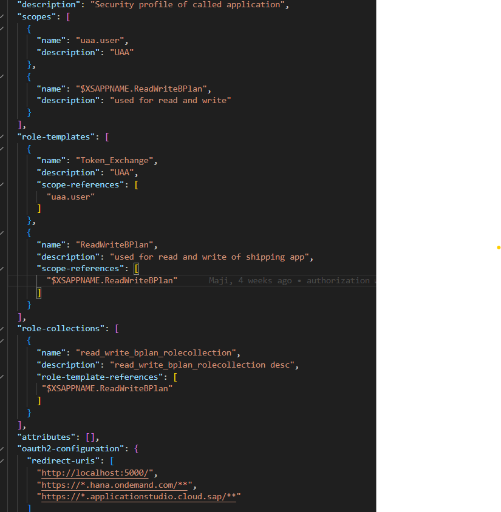
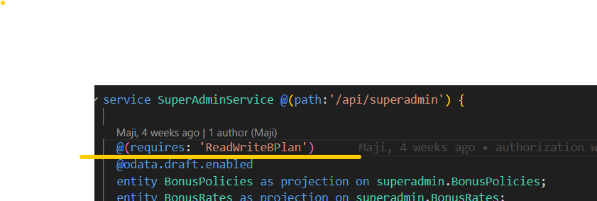

## Adding Authentication

* We have used XSUAA based authentication here
* Follow this link to setup router and xsuaa
https://cap.cloud.sap/docs/node.js/authentication#authentication-enforced-in-production

* Create xsuaa service in BTP and bind to local environment for Hybrid profile following same doc

* To run the applicaiton locally now with xsuaa, need to run 2 command.
    * cds watch --profile hybrid
    * cds bind --exec -- npm start --prefix app/router

## Adding Authorization

### Create scopes, roles and role-collections for the application 

We can create it using mta.yaml or xs-security.json or even directly in BTP. Here we have created it using xs-security.json

### Protect services using authorization 

**Note:** New Scopes, Roles and Role-collection can be created as per requirement by following same process.
