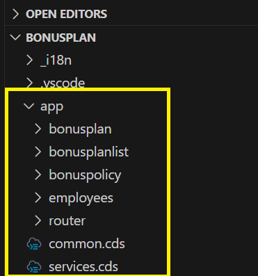

# Code structure details
Please find the code folder structure details in this section. Some of the files and folders are generated via CAP.

* **app** directory:  holds all the UI application along with the router. Directories (UI apps) are generated by using CAP's guided development. Common.cds is creaed to keep common annotations across multiple application.

        
* **db** directory generated by CAP at the time of project setup and holds database relate information like the schema and prepopulated data in data Directory.
* **openAPISchemas** directory holds SAP Sales and Service Cloud V2 api schemas in json format
* **srv** directory is one of the most important directory generated by CAP at the time of project setup, holds all the service entities and their implementation.
* **external** directory holds the csv models generated using jsons from "openAPISchemas" directory. These csn models are used in package.json to define external services.
* **test** directory contains unit test files.
