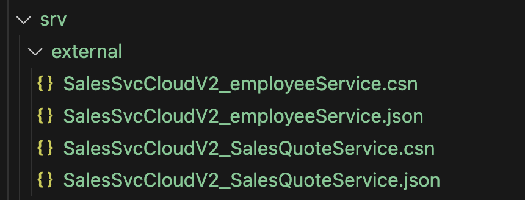
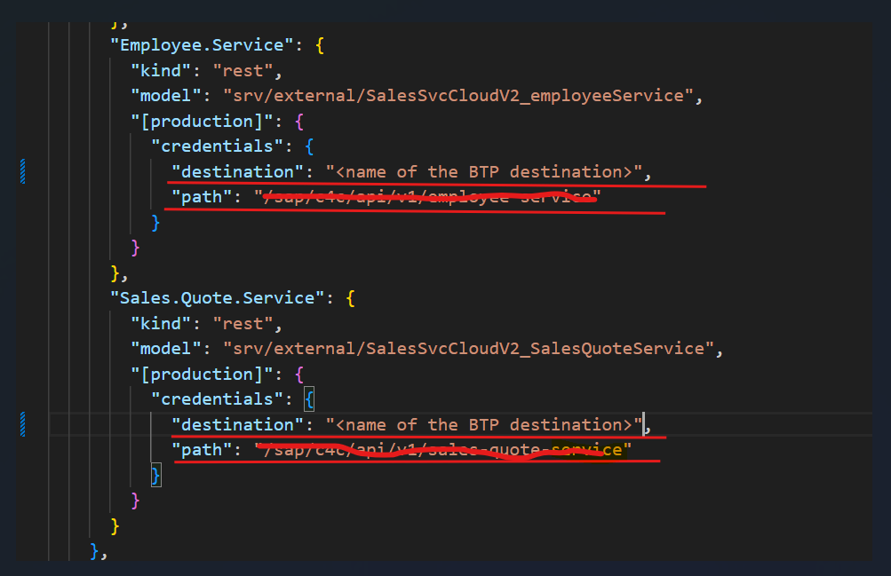
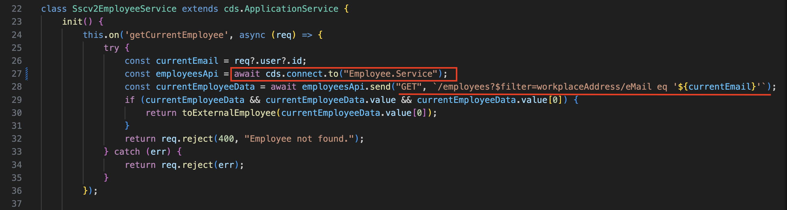
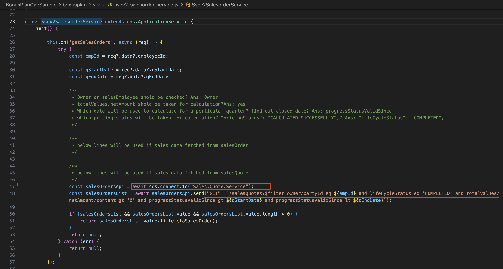

# Create Destination

Our application access SAP Sales and Service Cloud open apis to access employee, sales data etc, through BTP destinations. Please follow steps mentioned below to create destination:

* Go to your BTP main account and then navigate to subaccount
* Go to "connectivity" from left navigation and select destination.
* Select Create destination 
* Fill up all the necessary fields like name, type, url, authentication etc and click create.
Here URL is SAP Cloud for customer system URL , Authentication - basic authentication and user credentials are SAP Sales and Service Cloud credentials.


## Add created destination details in package.json
In CAP, external APIs can be consumed as explained [here](https://cap.cloud.sap/docs/guides/using-services). 

In this sample, we have consumed 2 external APIs from SAP Sales and Service Cloud V2.

1. Sales.Quote.Service
2. Employee.Service

Once the desired API models are imported following the [CAP document](https://cap.cloud.sap/docs/guides/using-services), the API definitions are added automatically to the [package.json](../bonusplan/package.json#L90-L108) in the CAP project.

The API models can be found in the `bonusplan/srv/external` folder.



So, after adding destination in BTP, the destination name has to be updated for those API definitions in [package.json](../bonusplan/package.json#L90-L108).



After updating the package.json, a secret file needs to be added to save the credentials. Name of the file should be `.cdsrc-private.json`. **This file should be a private file for security reason**. It should be saved inside `bonusplan` folder. The content of the file should be as follows:
```
{
  "requires": {
    "Sales.Quote.Service": {
      "[development]": {
        "credentials": {
          "url": "https://*******.com",
          "username": "*******",
          "password": "*******"
        }
      }
    },
    "Employee.Service": {
      "[development]": {
        "credentials": {
          "url": "https://*******.com",
          "username": "*******",
          "password": "*******"
        }
      }
    }
  }
}
```
<br>

# Code for consuming external APIs
Please find the code details for consuming SAP Sales and Service Cloud V2 REST APIs, in this section. The API authentication is implemented through BTP destinations which is already described above in create destination section.

* **SSC V2 Employee API**:  Connects to external Employee API to get the list of employee and to update Employee extension field.

    
    
* **SSC V2 Sales Quote API** Connects to external Sales Quote API which is used in the bonus calculation logic.

    
    
