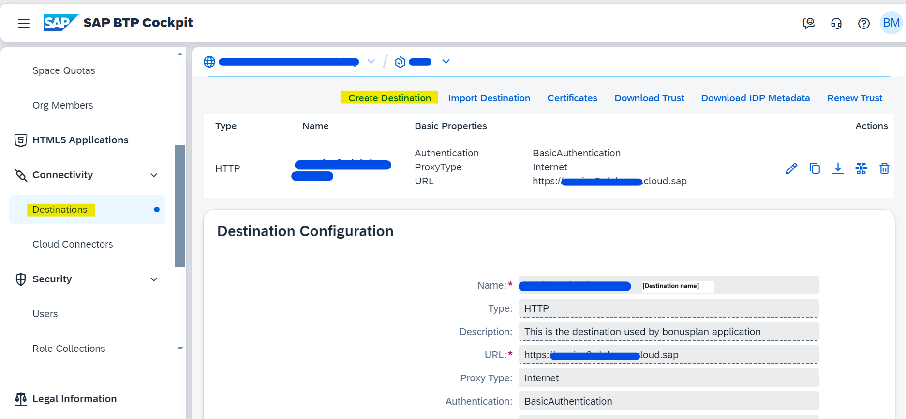
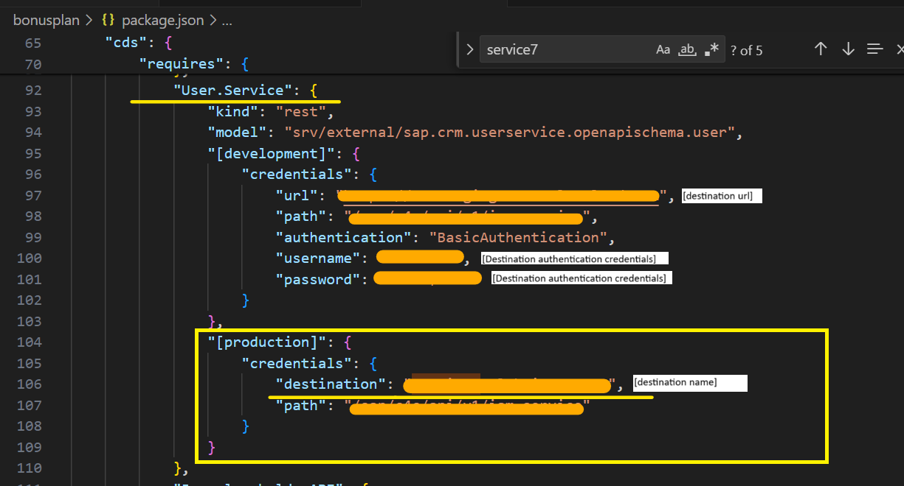

# Create Destination

Our application access SAP Sales and Service Cloud open apis to access employee, sales data etc, through BTP destinations. Please follow steps mentioned below to create destination:
* Go to your BTP main account and then navigate to subaccount
* Go to "connectivity" from left navigation and select destination.
* Select Create destination 
* Fill up all the necessary fields like name, type, url, authentication etc and click create.
Here URL is SAP Cloud for customer system URL , Authentication - basic authentication and user credentials are SAP Sales and Service Cloud credentials.

## Add created destination details in package.json
In source code's package.json file, please add destination details under **[production]** section as per image below. Since we are running directly on BTP, we are maintaining destination details under production only. Please note **[development]** section is used when running the application locally which will be covered later in main document.

 
    

