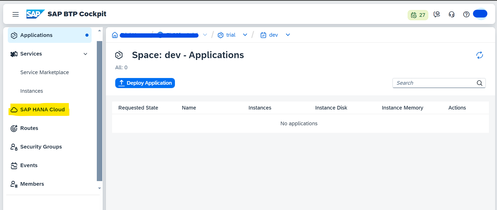
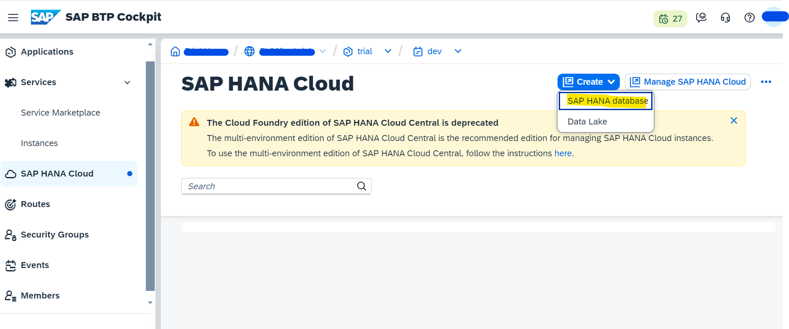
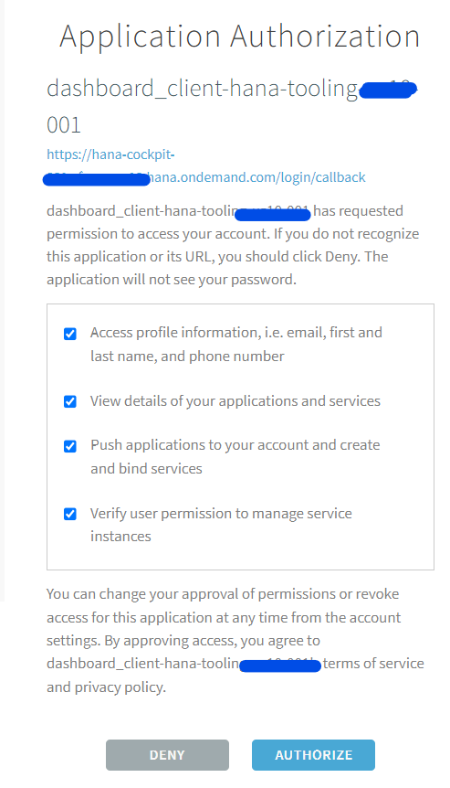
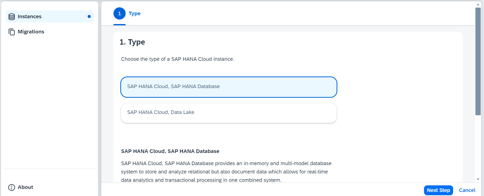
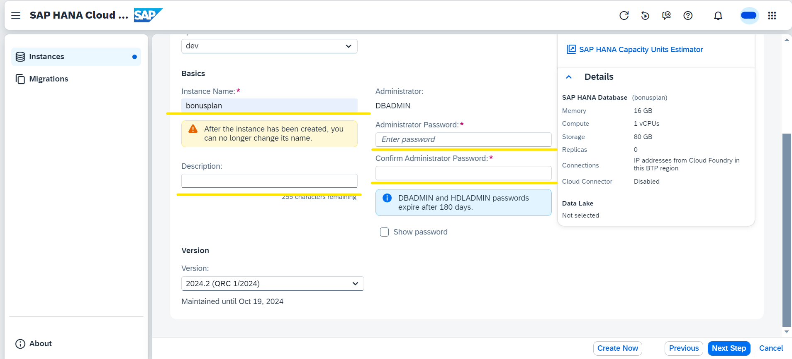
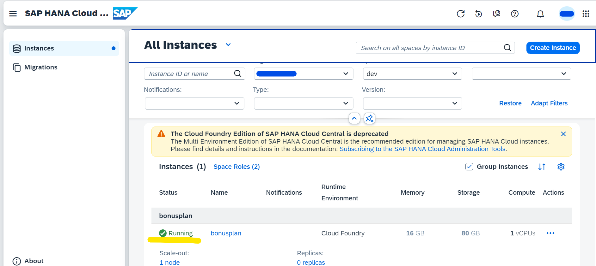

# Create Hana DB on BTP

Following are the steps to create Hana DB on BTP 

* Go to your BTP account and go to space
* Click on "SAP HANA Cloud" displayed in left menu.
    
* Click on Create SAP Hana Database.
    
* This will open a new Hana dashboard. Login and authorize as prompted by the dashboard.
    
* Next step to select a database type and click on "Next Step".
    
* In this step provide a "Instance Name" and set Administrator password.
    
* Click on Next and come to step "SAP HANA Database Advanced Settings". Here select "Allow all IP address"
* Click Next and "Review and Create"
* This will take some time to create the instance. After some time the database will be up and running. Running status will be shown as per below image
    
