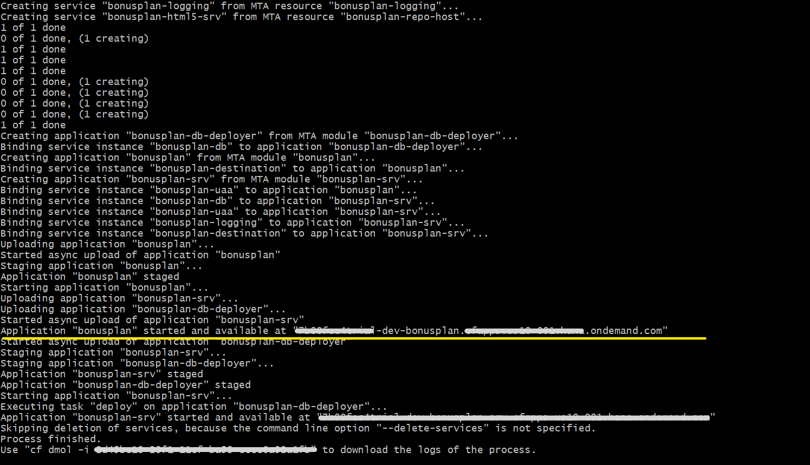

### Build and Deploy Applicatiom to Cloudfoundry
#### Preparation 
Please make sure following Prerequisites are already taken care-
* Keep BTP account and database running [From Capire documentation](https://cap.cloud.sap/docs/guides/deployment/to-cf#btp-and-hana)
* Keep Cloud MTA Build Tool installed [ from Capire documentation](https://cap.cloud.sap/docs/guides/deployment/to-cf#mbt)
* Install Cloud Foundry CLI w/ MTA Plugins [ from Capire documentation](https://cap.cloud.sap/docs/guides/deployment/to-cf#cf-cli)

#### Build
* Update dependencies using **npm update --package-lock-only**. [Reference from Capire documentation](https://cap.cloud.sap/docs/guides/deployment/to-cf#freeze-dependencies)
* Build the application using **mbt build**. [Reference from Capire documentation](https://cap.cloud.sap/docs/guides/deployment/to-cf#assemble-with-mbt-build)
#### Login to CF and deploy
* Login the cloud foundry using:
**cf login -a [account] -o [subaccount] -s [space]**
* Deploy using: **cf deploy mta_archives/bonusplan_1.0.0.mtar**
* After completion of deployment bonusplan url can be seen in terminal.Please make note of this URL, as it would be needed to launch the application in next steps.  After successful deployment, terminal will look similar as shown below:
    
