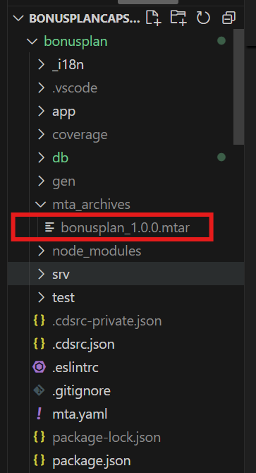

# Build and Deploy Application to Cloudfoundry
Once the application is developed in local system, we can start our preparation to deploy to cloud foundry.

## Preparation 
Please make sure following Prerequisites are already taken care-
* Keep BTP account and database running [From Capire documentation](https://cap.cloud.sap/docs/guides/deployment/to-cf#btp-and-hana)
* Keep Cloud MTA Build Tool installed [ from Capire documentation](https://cap.cloud.sap/docs/guides/deployment/to-cf#mbt)
* Install Cloud Foundry CLI w/ MTA Plugins [ from Capire documentation](https://cap.cloud.sap/docs/guides/deployment/to-cf#cf-cli)

## MTA setup
To deploy the application to Cloud Foundty, the mta.yaml file should be present and configured correctly.
* if mta file is not added to the applicaiton, follow [here](https://cap.cloud.sap/docs/get-started/grow-as-you-go#deploy-to-cloud) to create it.
* Above step will create the file with almost all the configuration needed.
* Some configuration may be needed for UI application in the "before-all" section of the mta file. This is described [here](#mta-configuration-for-ui) as per our scenario.

## Build
Once the mta.yaml file created and configured correctly, following steps can be followed to build the application, which will create a deployable file with extension as "mtar".
* Update dependencies using **npm update --package-lock-only**. [Reference from Capire documentation](https://cap.cloud.sap/docs/guides/deployment/to-cf#freeze-dependencies)
* Build the application using **mbt build**. [Reference from Capire documentation](https://cap.cloud.sap/docs/guides/deployment/to-cf#assemble-with-mbt-build)

## Login to CF and deploy
Once the bukld is created, the application can now be deployed to cloud foudry. Explanation from Bonusplan scenario is described in upcoming points.
* Login the cloud foundry using:
**cf login -a [account] -o [subaccount] -s [space]**. Example reference [here](#login-to-cf)
* Deploy using: **cf deploy [mtar file path]**. Example reference [here](#deploy-mtar-file)
* After completion of deployment bonusplan url can be seen in terminal. Please make note of this URL, as it would be needed to launch the application in next steps.

## Explanation from bonusplan scenario

### MTA configuration for UI
* All the UIs and related schema, cds and other required files  should be added to mta.yaml file as per below image.
    

* Once the build is created, the build file will look like this - build-path

    

### Login to CF
The login to CF script output will look like below-

### Deploy mtar file
* Deploy using: **cf deploy mta_archives/bonusplan_1.0.0.mtar**
* After successful deployment, terminal will look similar as shown below:
    
The highlighted url is the entry point of the application.
