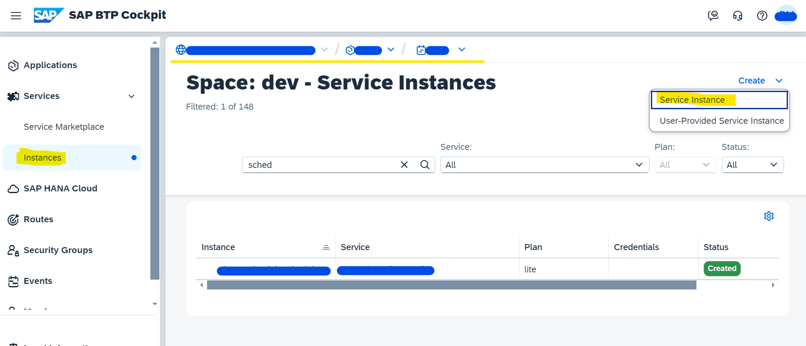
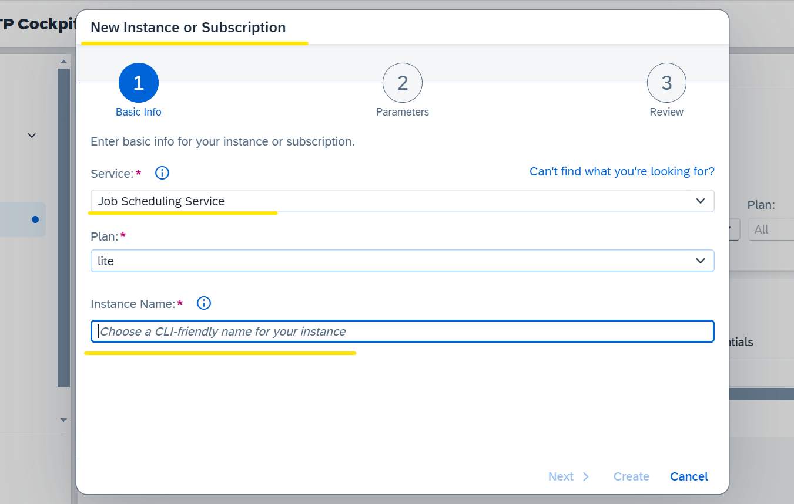
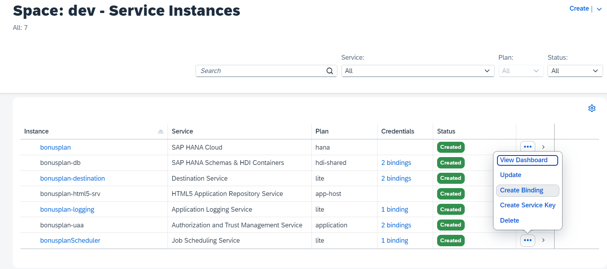
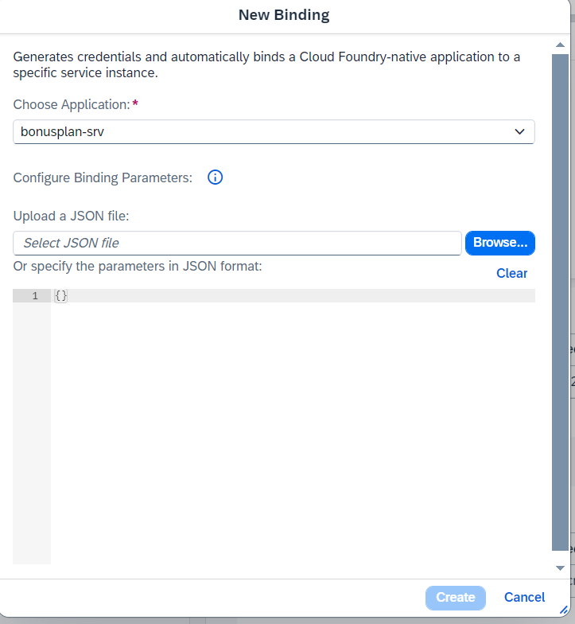
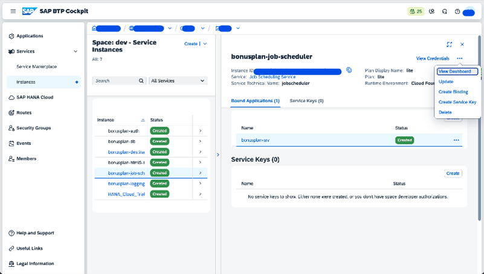
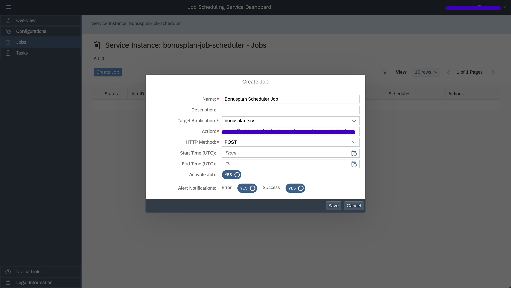
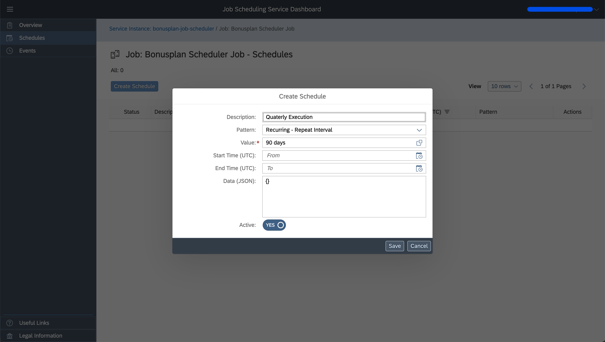
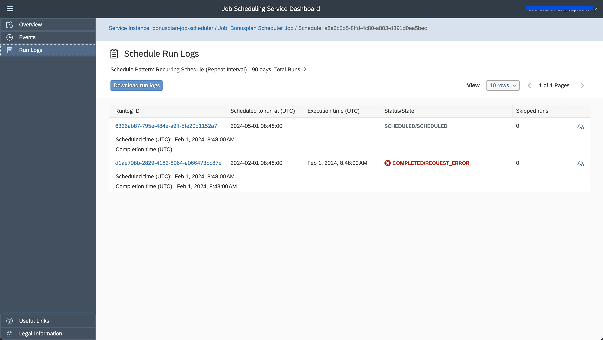

# Scheduler Configuration(optional)

As explained in reference scenario, bonus is calculated manually from UI or by configuring jobs which will automatically calculate bonus periodically. This section explains how job scheduler can be configured in BTP

* Go to BTP and select your account, subaccount and space.
* Click on "Instances" and then click on "create service instance"

* Select service as "job scheduling service" and give a instance name, click next and create the instance.
 
* Now the bonusplan-srv application to be bound to the instance. bonusplan-srv is created during deployment.
    
    

* Now go to Job Scheduler Dashboard from BTP Instance

* To create a job, go to "Jobs", found in left navigaiton, and click on Create Job. In the Target applicaiton dropdown select application "bonusplan-srv".
In the Action, we need to add action endpoint which will look like "[application-url]/api/admin/calculateBonusesAction", here /api/admin is the endpoint and calculateBonusesAction is the action. 

    Please note: "calculateBonusesAction" action is created as part of Employee service. HTTP Method is POST by default in CAP service actions.

* In Create Schedule screen set recurring schedule as per need

* Schedule Logs can be viewed here

