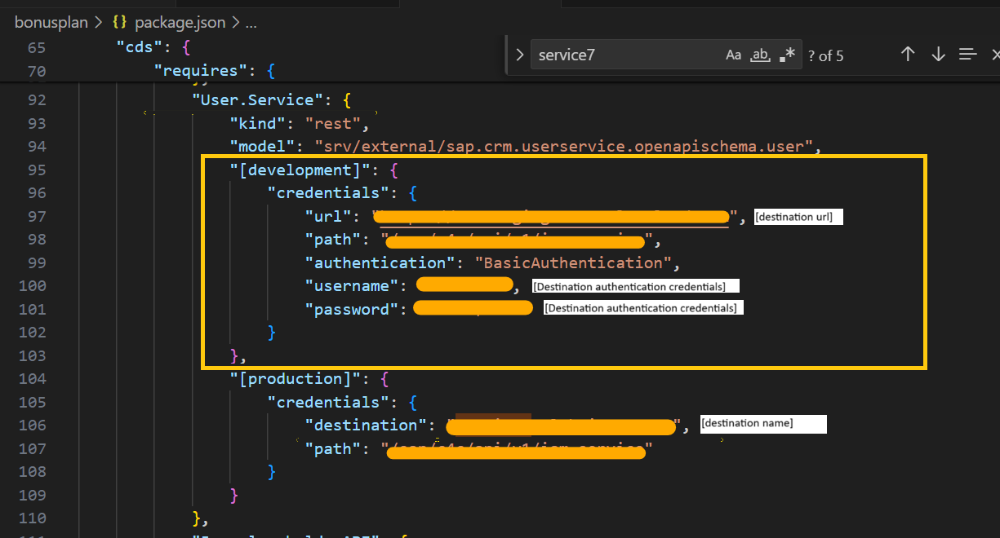

# Local setup guide

Since this application is using XSUAA service for authentication and authorization, we need to login to BTP to use these services while running the application locally
* login to your BTP account using **cf login -a [account] -o [subaccount] -s [space]**
* [Download application code and install npm dependencies](../Files/setup.md)
* Bind UAA service locally using **cds bind -2 bonusplan-uaa**. So that application can use BTP xsuaa service. 
* Populate local destination in Package.json. This destination is used to access SAP Sales and Service Cloud open apis
     
* Open 2 terminal and run following 2 command in 2 terminal
    * **cds watch --profile hybrid**
    * **cds bind --exec -- npm start --prefix app/router**
* Local applicaiton url will be localhost and port will be displayed in the second terminal.

## Sample Urls and screens 
* Sample Url: "http://localhost:5000/bonuspolicy/webapp/index.html"
     
* Sample url of Employee screen: "http://localhost:5000/employees/webapp/index.html"
    
* Sample url of Bonus plan screen: "http://localhost:5000/bonusplanlist/webapp/index.html?empid=[employee-id]"
    

Please note: <b>[employee-id]</b> is uuid of employee in SAP Sales and Service Cloud
    