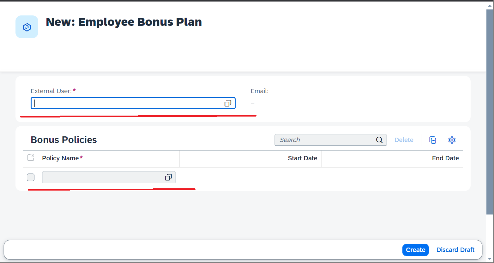
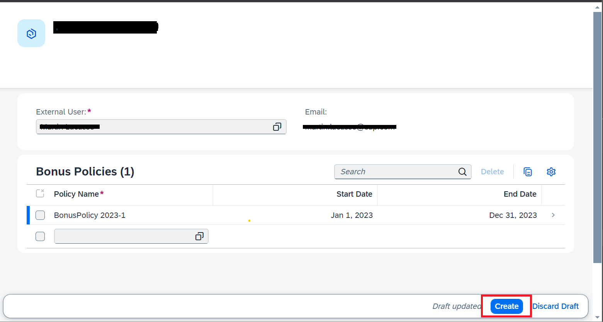
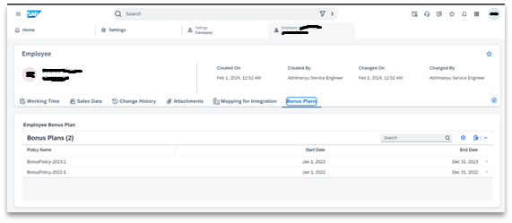
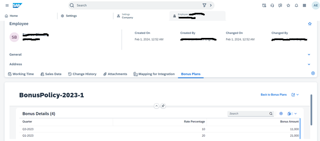

# How to use this application?

This section will help and guide on how to use the application. This is same as explained in scenario details earlier.

## Create policy data- Admin persona
Bonus Policy screen can be accessed using following URL "https://[application]/bonuspolicy/webapp/index.html"

 * The "Policy" landing page displays all the Policies. In this application, we have created some sample policies as well.
     
* On clicking on “Create” button. This will open a create screen, where admin needs to enter “Policy Name”, “policy description”, “Start date” and “End date”.
* The bottom section is Bonus rates table. Fill up applicable bonus rates for this particular policy. Please note: Quarter should be in this format: “Q1_2022” / “Q2_2022” / “Q3_2022” / “Q4_2022”
     
* Clicking on “Create” will create a new Policy.
* Policy landing page will now have the newly created Policy.

**Note** 
* A Policy should be for a full year. 
* Rates should be divided into 4 quarterly rates. 
* Quarter should be in this format: “Q1_2022” / “Q2_2022” / “Q3_2022” / “Q4_2022”

## View and Assign bonus policies to Employee- Admin Persona
Employee screen can be accessed using following URL "https://[application]/employees/webapp/index.html"

* The "Employees" landing page displays all the users who are already assigned to any bonus policy (if any).
    
* On clicking on “Create” button, it will open a create screen, where user, who will be assigned to a bonus policy, can be searched and selected.
     
* From the bottom part, all the policies, which will be assigned to the employee, need to be selected.
    
* Click on “Create” to complete the assignment.
* "Employee" landing screen, now will display the new assignment.

## Employee view using Mashup- Employee Persona
Employee can view bonus details by navigating to Employee details screen in SAP Sales and service cloud application. In previous steps, we had embedded this view in SAP Sales are Service Cloud V2 application

* Employee view of Bonusplan dashboard

    
*  On click of any list record, the details will be displayed

    
