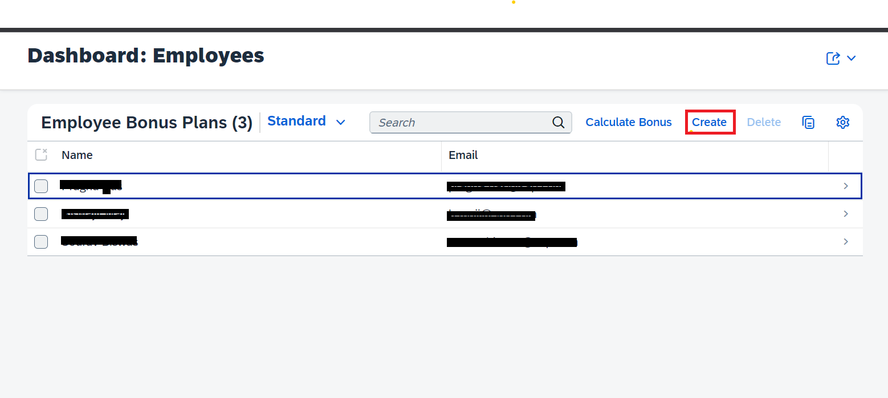

## Reference Scenario
### Scenario
Please find the details of reference scenario in this section.

Bonus plan is an application developed for employees to be part of bonus programs according to their contribution in terms of sales. This application helps admin to create different bonus policies and then policies can be assigned to employees according to their relevance. After completion of each quarter, actual bonus amount for employees will be calculated and displayed.

In the Employee page of SAP Sales and Service Cloud, a custom tab is created and bonus details is added via mashup. Employees can see their own policies and the bonus amounts calculated for the completed quarter in employee details page.

So basically we have two personas/roles here- Admin and Employee respectively

### Application usage details
#### View and create Master data (Bonus Policy) (Admin)
To work with Bonus plan application, at first, Policies need to be created by Admin. Policy includes name, start and end dates. For each policy, quarterly bonus rates need to be created.

<!-- Go to https://[application]/bonuspolicy/webapp/index.html.   -->
* The Bonus Policy dashboard page displays all the Policies already exist in the system. Search is allowed to search a specific policy. UI looks like as shown below:
     
* On clicking on “Create” button,create screen will get open, where admin needs to enter “Policy Name”, “policy description”, “Start date” and “End date”. Policy should be for full year.
* The bottom section is Bonus rates table. Fill up applicable bonus rates for this particular policy. Rates should be divided into 4 quaterly rates. Quarter should be in this format:"Quater_year" for eg: “Q1_2022” / “Q2_2022” / “Q3_2022” / “Q4_2022”.Here "Q" is in caps.
     
* Clicking on “Create” will create a new Policy.
* Policy List will show newly created policy

#### View and Assign bonus policies to Employee(Admin)
Employees need to be assigned to Bonus policies, so that employees can be part of the bonus program.

<!-- Go to https://[application]/employees/webapp/index.html.    -->
* The "Employees" landing page displays all the users who are already assigned to any bonus policy.
    
* On clicking on “Create” button, it will open a create screen, where user, who will be assigned to a bonus policy, can be searched and selected.
     
* From the bottom part, all the policies, which will be assigned to the employee, need to be selected.
    
* Click on “Create” to complete the assignment.
* "Employee" landing screen, now will display the new assignment.

#### Calculate Bonus
Bonus amount is calculated on quarterly basis. In our bonus plan application,bonus is calculated based on salesquotes completed by employee in particular quater. To calcluate the bonus of every employee , automatic jobs are run periodically. Also, bonus calculation can be triggered manually by clicking on "Calculate Bonus"  button on UI, as shown below. This action will calculate bonus for all the employees in the list.

 

#### Employee view using Mashup(Employee)
Employee can view bonus details by navigating to Employee details screen in SAP Sales and service cloud application, as shown below:
 
 
 
 Click of any list item to view details

 

### Validations
We have added various validation to our project, like if any required field is missing, or if same employee is being assigned to dupicate bonus policy etc. 

Some of these validation are used from CAP in-build features, however custom validations are created manually.

### Scenario service diagram

