## API Guidelines

This page outlines the API guidelines that external/custom services must adhere to. Additionally, examples of a successful response structure is provided in the document.

### API URL 
- API URL information should be provided in metadata and the HTTP Methods like GET, POST, PATCH, DELETE should be supported on that URL:
API URL must be in format : `https://<application-url>/<api-Path>/`

   - __application-url__: This is domain URL and is mentioned while creating Custom service from admin settings
   - __api-path__ : Relative API path given in metadata json. 

Example of API URL: 
https://XXX.hana.ondemand.com/project-order-service/ProjectOrder

"https://XXX.hana.ondemand.com" is  __(application-url)__

 "/project-order-service/ProjectOrder" is __(api-path)__
 
 Once API information is uploaded via metadata, it will be appear in custom service UI as shown below:

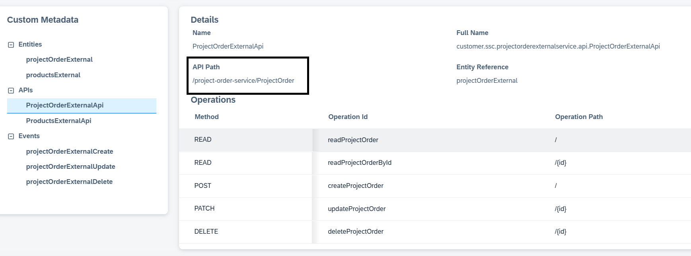

Refer [metadata guideline](./Metadata.MD) for more details on API information. Various CRUD operations will be performed as per API information uploaded in metadata.

#### Support $Search, $Filter, $Skip, $Count, $Top
- $Search, $Filter, $Skip, $Count, $Top should be implemented in the service as per guideline below:
   - __$top, $skip__ 
     For the APIs, the pagination is primarily client-driven i.e., the client has to request for the pages from the API and the API responds accordingly.
     | Query Parameter | Description                                                                                     |
     |------------------|-----------------------------------------------------------------------------------------------|
     | `$top`           | Indicates page size.                                                                          |
     |                  | - **Max Page Size**: The maximum page size supported is 999.                                  |
     |                  | - **Default Page Size**: 50.                                                                  |
     |                  | *These numbers can change in the future.*                                                     |
     | `$skip`          | Indicates the offset (number of items). For example, if the page size is 100 and the user is  |
     |                  | navigating to the 10th page, the offset (`$skip`) would be 900 (9 * 100).                     |
   - __$search__  
      | Query Parameter | Description                                      |
      |------------------|--------------------------------------------------|
      | `$search`        | Indicates the search expression for the collection. |
       - The value for search is considered as an expression.
       - The search expression SHOULD be enclosed in double quotes ("..").
       - Phrases SHALL be enclosed in double quotes ("This is a value").
       - If the search value is a single word, quotes can also be skipped though not recommended. API providers need to support this case whereas for standard UI, it is recommended to use double quotes.
       - If enclosed in single quotes, a 400 Bad Request response is sent.
       - Wildcards (e.g. *) SHALL NOT be provided. A ranked search is performed to get the best match.

  - In Custom Service currently for __$filter__ only eq operator is supported for the string literals . Other operators will be supported in the future.
 Refer [example](#example--successful-200-response-structure-for-various-http-request-methods-and-operations) section for more details with example.

  ### HTTP Verbs
  Various operations supported by custom service:
  
| CRUD Operation      | HTTP Verb | Meaning                                                                                                                                                     | Example                                                                                   |
|----------------------|-----------|-------------------------------------------------------------------------------------------------------------------------------------------------------------|-------------------------------------------------------------------------------------------|
| Query               | GET       | Query a collection of resources.                                                                                                                           | `https://xyz.cxm-salescloud.com/api/lead-service/leads`                                   |
| Create              | POST      | Create a resource in a collection.                                                                                                                         | `POST https://xyz.cxm-salescloud.com/api/lead-service/leads`                              |
| Read                | GET       | Read a single resource.                                                                                                                                    | `GET https://xyz.cxm-salescloud.com/api/lead-service/leads/290929`                        |
| Update (partial)    | PATCH     | Update a resource partially, replacing only the values specified in the request. Support for `PATCH` is not mandatory. If supported, conflict handling has to be performed via ETag. | `PATCH https://xyz.com/api/lead-service/leads/290929`                                    |
| Delete              | DELETE    | Deletes a resource. When successful, the resource is no longer available via API. The actual implementation of delete (soft vs hard) depends on service requirements. A `DELETE` SHALL and can only be performed on a single resource. | `DELETE https://xyz.com/api/lead-service/leads/290929`                                   |

Please Note- PUT is not supported

### HTTP Status code and Messages 
 For guidelines related to the following, please refer to [here](./ErrorGuidelines.MD): 
-> HTTP response codes, 
-> Messages(error, warning, info) generated by the service.

### HTTP Header
  - If-match (Request Header) : 
     This header is used as part of request (PATCH) in cases where conflict management is required. The value represents the state of the resource available with the client (etag obtained from API is used as value for If-Match).When a consumer tries to update a resource, it informs the server to perform the update iff the state of resource known to the client (etag) matches the state of the resource in server.Services SHALL implement conflict handling for PATCH depending on the use case.The value of If-Match should be enclosed in double quotes ("2022-06-29T14:45:42.272Z"). If double quotes are missing, the extraction of the entity tag fails and pre-condition checks would not be successful (412 Precondition Failed).
  - Etag(Response Header):  
     ETag is used to indicate the state of the resource.APIs SHALL send the ETag for GET and PATCH.Use adminData.changedOn (the last modified timestamp) as the state identifier (ETag). Entity tag values should be enclosed in double quotes. 
  - csrf-token  
    Handling of csrf-token needs to be implemented at service. CSRF tokens are sent along with requests to the server to validate their authenticity. Example from       sample CAP service is shown below where csrf-protection is set to true and exposed in request/response headers.
    
    
## Example : Successful (200) response structure for various HTTP request methods and operations

### Request Method : Get
#### Get all records (Example : Get all project orders)
- Request URL :https://XXX.hana.ondemand.com/project-order-service/ProjectOrder?$count=true&$top=30&$skip=0
  Here , by default query string parameters to fetch count and first 30 records are sent in request. So service should support pagination and count.
- HTTP Method : GET
- Response : Successful response looks like below:
  
  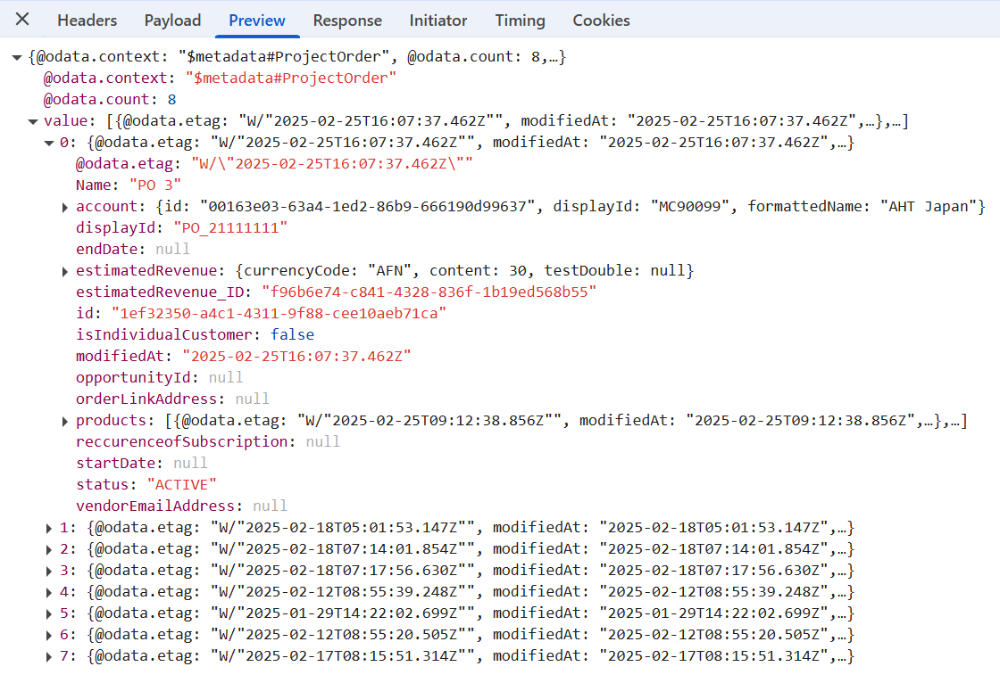

Points to note here:
- Response structure should have "count" attribute which contains total records value. In this example its total project orders. In case of CAP  service,"@odata.count" needs to be sent.
- Records needs to be sent as part of "value" array as shown in screenshot above. Please note "value" is treated as keyword here.

#### Search operation
Service should support "search"
- Request URL : https://XXX.hana.ondemand.com/project-order-service/ProjectOrder?$count=true&$search=%22Silver%20Project%22&$top=30&$skip=0

 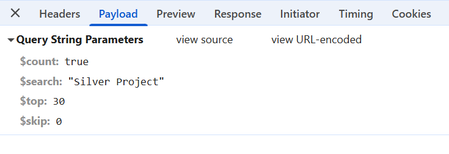
 
- HTTP Method : GET
- Response:
 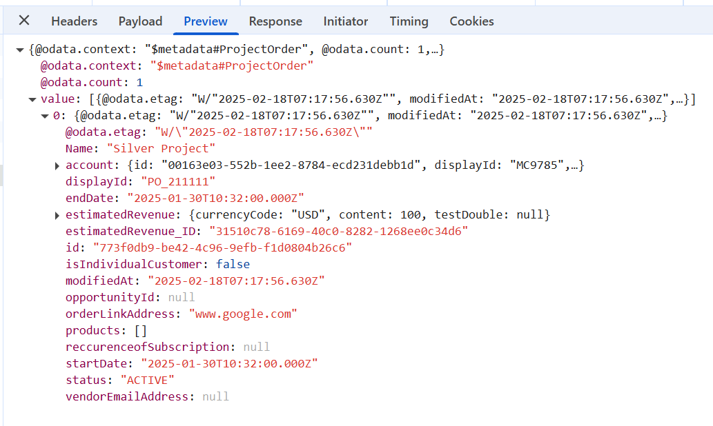

#### Filter operation
Service should support "filter"
- Request URL: https://XXX.hana.ondemand.com/project-order-service/ProjectOrder?$count=true&$filter=Name%20eq%20%27PO%203%27&$top=30&$skip=0
- Payload:
  
   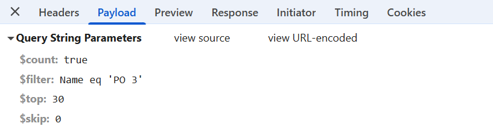

- HTTP Method : GET
- Response:
   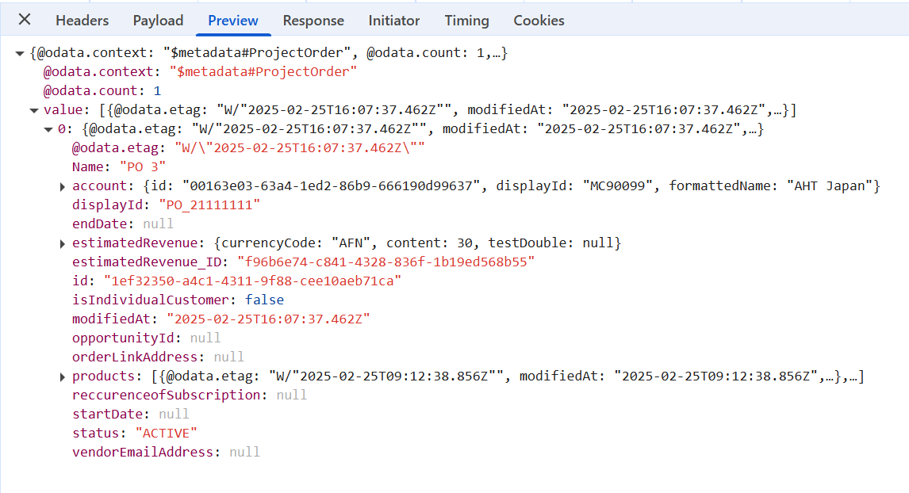
 
#### Get by ID (fetch particular record)
- Request URL : https://XXX.hana.ondemand.com/project-order-service/ProjectOrder/1ef32350-a4c1-4311-9f88-cee10aeb71ca
  Here, GET is done for project order having ID : "1ef32350-a4c1-4311-9f88-cee10aeb71ca"
- HTTP Method : GET
- Response : Response should be object as shown below:
  
  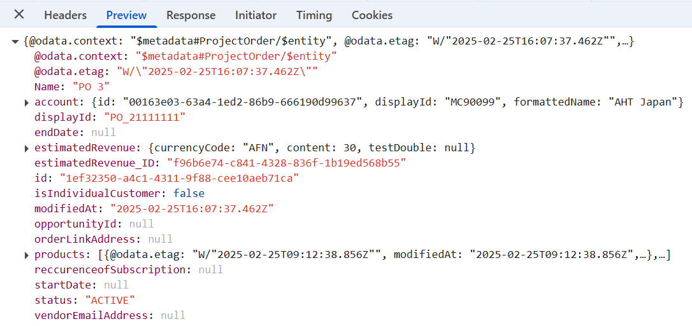

#### Patch (To update particular record)
- Request URL :https://XXX.hana.ondemand.com/project-order-service/ProjectOrder/773f0db9-be42-4c96-9efb-f1d0804b26c6
- HTTP Method : PATCH
- Request Payload (name PostRequestted)

 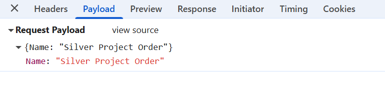
 
- Response
 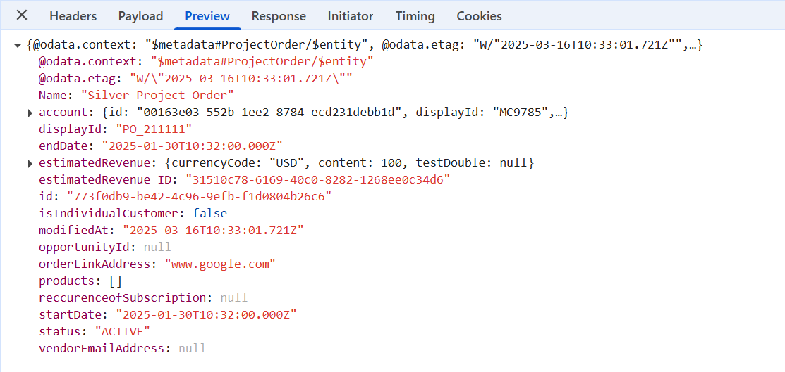

#### POST ( To create new record)
- Request URL : https://XXX.hana.ondemand.com/project-order-service/ProjectOrder
- HTTP Method : POST
- Request payload :
 
 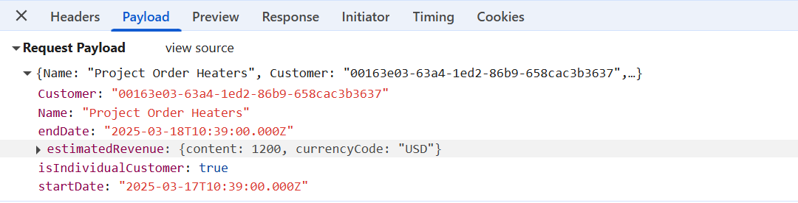

- Response:

 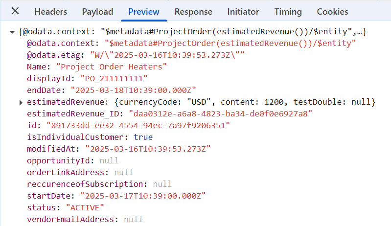

    

