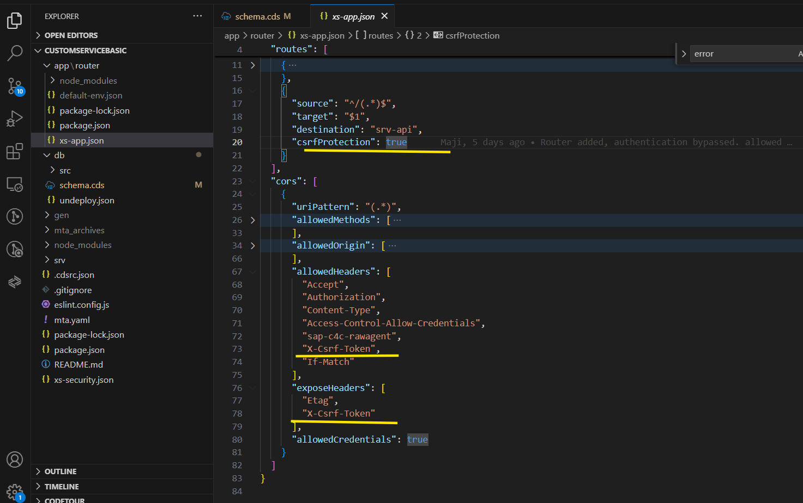

## API Guidelines

This page gives you the guidelines to follow, when creating a Service which you want to integrate with the SSCV2. These guidelines are language agnostic.  

Refer below sections for various guidelines for APIs

### API URL 
- API URL should be in this format and all the HTTP Methods like GET, POST, PATCH, DELETE shoudl be supported:
`https://<application-url>/<service-name>/`

   - __application-url__: This is domain URL and in mentioned while creating Custom service from admin settings
   - __service-name__ : This is name of service specified in metadata.

- To fetch the entity data, URL should be in format:
  `https://<application-url>/<service-name>/<entity-name>`  
 
    here, __entity-name__ is the name of entity and is specified in metadata.

- Similarly to fetch the data of child entity for particular entity record, URL will be :
  `https://<application-url>/<service-name>/<root-entity-name>/<root-entity-ID>/<child-entity>`
- $Search, $Filter, $Skip, $Count, $Top should be implemented in the service as per guideline below:
   - __$top, $skip__ 
     For the APIs, the pagination is primarily client-driven i.e., the client has to request for the pages from the API and the API responds accordingly.
     | Query Parameter | Description                                                                                     |
     |------------------|-----------------------------------------------------------------------------------------------|
     | `$top`           | Indicates page size.                                                                          |
     |                  | - **Max Page Size**: The maximum page size supported is 999.                                  |
     |                  | - **Default Page Size**: 50.                                                                  |
     |                  | *These numbers can change in the future.*                                                     |
     | `$skip`          | Indicates the offset (number of items). For example, if the page size is 100 and the user is  |
     |                  | navigating to the 10th page, the offset (`$skip`) would be 900 (9 * 100).                     |
   - __$search__  
      | Query Parameter | Description                                      |
      |------------------|--------------------------------------------------|
      | `$search`        | Indicates the search expression for the collection. |
       - The value for search is considered as an expression.
       - The search expression SHOULD be enclosed in double quotes ("..").
       - Phrases SHALL be enclosed in double quotes ("This is a value").
       - If the search value is a single word, quotes can also be skipped though not recommended. API providers need to support this case whereas for standard UI, it is recommended to use double quotes.
       - If enclosed in single quotes, a 400 Bad Request response is sent.
       - Wildcards (e.g. *) SHALL NOT be provided. A ranked search is performed to get the best match.

  - In Custom Service currently for __$filter__ only eq operator is supported for the string literals . Other operators will be supported in the future.

  ### HTTP Verbs
| CRUD Operation      | HTTP Verb | Meaning                                                                                                                                                     | Example                                                                                   |
|----------------------|-----------|-------------------------------------------------------------------------------------------------------------------------------------------------------------|-------------------------------------------------------------------------------------------|
| Query               | GET       | Query a collection of resources.                                                                                                                           | `https://xyz.cxm-salescloud.com/api/lead-service/leads`                                   |
| Create              | POST      | Create a resource in a collection.                                                                                                                         | `POST https://xyz.cxm-salescloud.com/api/lead-service/leads`                              |
| Read                | GET       | Read a single resource.                                                                                                                                    | `GET https://xyz.cxm-salescloud.com/api/lead-service/leads/290929`                        |
| Update (partial)    | PATCH     | Update a resource partially, replacing only the values specified in the request. Support for `PATCH` is not mandatory. If supported, conflict handling has to be performed via ETag. | `PATCH https://xyz.com/api/lead-service/leads/290929`                                    |
| Delete              | DELETE    | Deletes a resource. When successful, the resource is no longer available via API. The actual implementation of delete (soft vs hard) depends on service requirements. A `DELETE` SHALL and can only be performed on a single resource. | `DELETE https://xyz.com/api/lead-service/leads/290929`                                   |

Please Note- PUT is not supported
### HTTP Status
 Follow standard codes for HTTP status 
 - 2XX - success codes
 - 3XX - redirection codes
 - 4XX - Error Due to client
 - 5XX- Error due to server

### Add HTTP Header
  - If-match (Request Header) : 
     This header is used as part of request (PATCH) in cases where conflict management is required. The value represents the state of the resource available with the client (etag obtained from API is used as value for If-Match).When a consumer tries to update a resource, it informs the server to perform the update iff the state of resource known to the client (etag) matches the state of the resource in server.Services SHALL implement conflict handling for PATCH depending on the use case.The value of If-Match should be enclosed in double quotes ("2022-06-29T14:45:42.272Z"). If double quotes are missing, the extraction of the entity tag fails and pre-condition checks would not be successful (412 Precondition Failed).
  - Etag(Response Header):  
     ETag is used to indicate the state of the resource.APIs SHALL send the ETag for GET and PATCH.Use adminData.changedOn (the last modified timestamp) as the state identifier (ETag). Entity tag values should be enclosed in double quotes. 
  - csrf-token  
    Handling of csrf-token needs to be implemented at service. CSRF tokens are sent along with requests to the server to validate their authenticity. Example from       sample CAP service is shown below where csrf-protection is set to true and exposed in request/response headers.
    
    

