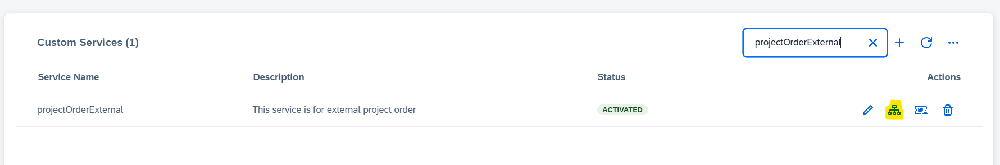

## Maintain Host for Custom Service

This document outlines the steps for maintaining the host (Domain URL) for a custom service.

Once the custom service is created with the metadata JSON containing API information, click on the "Maintain Host" icon in the actions column, as shown below:

   

Please select the Connection Type from the following options: 
 -> Direct Connection 
 -> Backend Connection

 Details of these connection types is mentioned below: 

 ### Direct Connection
  Please provide "Host URL" for Direct Connection. It is the domain URL of service API.
  Example : https://XXX.hana.ondemand.com

  Features: 

  * As name suggests, direct call to external/custom service is triggered from SAP Sales and Service cloud application.
  * External service should support SSO.
  * Service should take care of CORS setting.

  ### Backend Connection
  In this type, the call to the external service API is not made directly; instead, it is routed through a backend service. This is a standard backend service within SAP Sales and Service Cloud, essentially making it a server-to-server call.

  To maintain the Backend connection type, __pre-requisite__is to have coomunication system of type outbound configured with the domain url of external service.
   
   Once communication system is provided, select the operations(provided in metadata) which should be supported. 

  Please refer [here](./comsys.MD) for more detail on how to create new communication system.
  Please check [Help document](https://help.sap.com/docs/CX_NG_SVC/56436b4e8fa84dc8b4408c7795a012c4/1b2487fbb9b2440a9cdc99681adb11a0.html?q=Communication+system) for more updated details on communication system.

  Features:

  * Server to server call
  * SSO is not needed
  * Connection is based on authentication method provided in communication system. We are supporting "oAuth 2.0 Client credentials","oAuth 2.0 SAML Bearer Assertion"    for custom service.
  * Recommended method is- "oAuth 2.0 SAML Bearer Assertion" mainly for user propagation.
  

  

