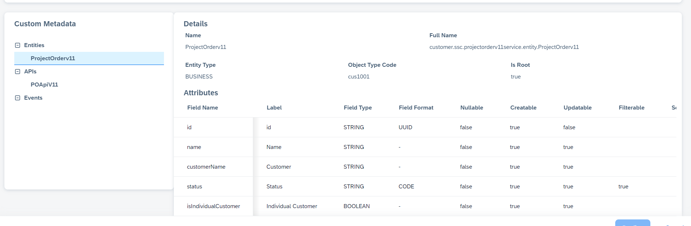
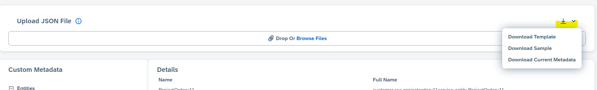

## Metadata

When integrating external services, such as those on SAP BTP, into SAP Sales and Service Cloud V2(SSCV2) as custom services, inconsistencies may arise due to differences in data types, attributes, associations, and operations. To address this, a JSON file is used to map the external service details to structure expected in SSCV2. By explicitly defining these mappings in the JSON file, you ensure seamless and accurate service integration.

It is important to note that SSCV2 currently does not support metadata versioning. As a result, any changes to the external service require manual updates to the metadata file. Additionally, rollback to a previous state is not supported, emphasizing the need for careful management and backup of metadata files.

Please note - Metadata json file should be upto 5 MB

Uploaded metadata looks like this:

There are various options provided for metadata 

 - Download Template : To download metadata template with placeholder which can be edited as per use case to upload
 - Download Sample : To download example template for reference
 - Download Current Metadata : To download the uploaded metadata

The metadata is primarily divided into four sections:
- Service Information: Details of service like- name, description etc.
- Entities: Contains entity information along with the mapping structure required by SSCV2.
- APIs: Contains details of APIs for various methods such as GET, POST, PATCH, and DELETE.
- Events: Includes information about events triggered by the external service. For example, an event(projectOrderCreate) is raised when a project order is created in the external service.

Lets check the properties for each of above mentioned section in details -

### Service Information:
__name__	:
   Unique Technical name of the service which would be used to create a service's full name (e.g., “ProjectOrder”). Must not include the word ‘service’. No special characters supported. 
__title__ : 
 	Display name of the service, readable name used in the UI. 
__description__ :
     Description of the service. This property can be used to explain the purpose of the service.  
__authorizationRelevant__
  This property is responsible for the service to be listed in service assignemnet for a business role. Value of this property needs to be set as true. If its set as false, this particualr service would not be available for role assignment..

### Entities
Each entity represents a functional data unit (e.g., a business object).

__name__ : Technical name for the entity (e.g., “ProjectOrderNS”). Every entity needs to have a unique technical name within a service. This name would be used to generate the entity's fullname. The technical name needs to be alpha numeric with lower Camel case. 
__label__:	Display name of the entity (e.g., “Project Order”). The translation support of these labels is supported via the Language Adaptation Tool.  
__entityType__	Type of entity, such as BUSINESS. 
__objectTypeCode__	 Code representing the object type, typically used in integrations. this is a 4 digit value prefixed with 'CUS'. This property is added for Root Entity as of now. If type code is not provided by the user, programmmatically it would be generated. This is internally used for integration scenarios 
__root__ :Indicates if this is the root entity of the service. Root entity would be used for as base entity for generating uiviews.

####  Attributes : Defines properties of entity fields.
__name__ :	Technical name of the attribute (e.g., “id”, “name”). This should have the same name as external field. This is essential as an attribute name would be used for mapping the API response and display field values on UI. Attribute name needs to be alpha numeric with lower Camel Case. Underscore is supported. 
__label__:	Human-readable label for the attribute. The translation support of these labels is supported via the Language Adaptation Tool. 
__dataType__:	Data type of the attribute as per supported/expected by SAP Sales and Service Cloud V2 metadata (e.g., STRING, DATETIME). 
__nullable__:	Specifies if the attribute is optional or mandatory. From SAP, on the UI, an attribute marked nullable: false, will typically be validated to ensure they are filled before submission. On the External API(external service side), attribute with nullable: false, can throw an error if not provided in the request payload. 
__creatable__:	Indicates if the attribute can be set during entity creation. It ensures that only relevant attributes are allowed during entity creation, maintaining data integrity and preventing unauthorized modifications to system-managed fields. From SAP, on the UI, fields marked as creatable: true will typically appear in forms for creating new entities. On the External API(external service side), attributes with creatable: false can be ignored or rejected if included in the creation payload. 
__updatable__:	Indicates if the attribute can be modified after creation. This property ensures that only appropriate attributes can be modified after creation, maintaining data consistency and preventing unauthorized changes to immutable fields. From SAP, on the UI, fields marked as updatable: true will typically appear in forms for editing or updating the entity. On the Exteral API(external service side), attributes with updatable: false can be ignored or rejected if included in an update request 
__filterable__:	Specifies if the attribute can be used in filters (true or false). This property ensures that only relevant attributes are available for filtering, improving query performance and user experience by avoiding unnecessary or invalid filter options. From SAP, on the UI, attributes marked as filterable: true will typically appear in filter panels or dropdowns for filter functionality. On the External API, attributes with filterable: true can be included in query parameters or filter expressions, while those with filterable: false can be ignored or rejected. 
__searchable__:	Specifies if the attribute is searchable (true or false). This property ensures that only relevant attributes are available for search operations, improving search performance and user experience by focusing on meaningful and searchable fields. From SAP, on the UI, attributes marked as searchable: true will typically appear in search bars and global search. On the External API, attributes with searchable: true can be included in search parameters, while those with searchable: false can be ignored or rejected in search queries. 
__keyType__:	Defines if the attribute is a primary or foreign key (PRIMARY, FOREIGN). This property helps define the structural relationships between entities, ensuring data integrity and enabling efficient querying and navigation in both the database and application layers. On the External Database, primary keys ensure uniqueness and are often indexed for fast lookups. Foreign keys enforce referential integrity by linking related entities. On the External API, primary keys are typically required for operations like updates or deletions. Foreign keys are used to fetch or relate data between entities. From SAP, on the UI, Primary keys may not be directly visible but are used internally for operations. Foreign keys may appear as dropdowns or links to related entities. 
__objectReference__:	Specifies associations with other entities or services, including source and target attributes. This property is crucial for defining and managing relationships between entities or services, ensuring data consistency and enabling seamless integration across systems. On the External Database, it helps define foreign key constraints to enforce referential integrity. On the External API, it can in fetching of related data, such as retrieving customer details for a given customerId. From SAP, on the UI, it allows rendering of related data, such as showing a dropdown of customers for selection or displaying linked entity details. 
__description__ : Boolean, indicates if particular attribute is description of id field(Primary Key Type) and used to trigger navigation to QV, details This property is a key part of metadata that enhances readability, maintainability, and usability by providing clear explanations of entities, attributes, or properties. 
_displayId_ : Boolean, indicates if particular attribute is display id field, which could be used as alternate key. This property designates an attribute as a user-friendly identifier for the entity, improving usability and making it easier to reference or recognize records in both the UI and API. From SAP, on the UI, attributes marked as displayId: true are often displayed prominently in tables, forms, or dropdowns to help users identify records. On the External API, these attributes can be used in endpoints to fetch or reference entities instead of relying solely on the primary key. On the External Database, While not mandatory, attributes marked as displayId: true are often indexed for faster lookups.

### Events
Defines triggers for specific actions (e.g., create, update, delete). Events defines triggers for specific actions on entities, enabling automation, workflows, and integrations in response to changes in the system.

__name__ :	Technical name for the event (e.g., “projectOrderCreate”).Every event needs to have a unique technical name within a service. This name would be used to generate the event's fullname. The technical name needs to be alpha numeric with lower Camel Case. 
__entityReference__: The entity this event is associated with (e.g., “ProjectOrderNS”). This property links metadata events to a specific entity, ensuring the system knows which entity the metadata applies to. It is essential for defining relationships, operations, and triggers in the system. 
__trigger__:	Event trigger type, such as CREATE, UPDATE, or DELETE. It defines the condition under which the event is triggered, such as when an entity is created, updated, or deleted. It is essential for defining workflows, automations, and integrations in response to changes in the system.

### APIs

__name__:	Technical name for the API (e.g., “ProjectOrderApi”).Every api needs to have a unique technical name within a service. This name would be used to generate the event's fullname. The technical name needs to be alpha numeric with lower Camel Case. 
__entityReference__ : Reference of entity. This property links metadata apis to a specific entity, ensuring the system knows which entity the metadata applies to. It is essential for defining relationships, operations, and triggers in the system. 
__description__:	Brief description of the API’s purpose. 
__title__:	Display title for the API. 
__apiPath__:	Base path for the API (e.g., “/project-order-service/project-order”). 
__operations__ :	Defines operations like READ, CREATE, UPDATE, or DELETE, along with path and methods.It defines the specific actions an API can perform on an entity, including the HTTP method, path, and expected responses. It ensures the API is well-structured and adheres to standard practices for interacting with data. 
 
 Here operations is array of objects. Each object contains information of various HTTP methods, response, path. Attributes are mentioned below:
 
 "id" : unique meaningful id.Example: "readProjectOrder" 
 "path" : relative parth to perform operation. For example to read all(get all) records. Value can be "/". Particular record will be fetched based on primary key (entity attribute mentioned in metadata). So, path value in this case withh be like "/{id}", where id is just a placeholder name. 
 Please note - Placeholder name in path attribute should be unique for each entity per service. Means,if "/{id}" is already defined as path for say root entity, then for child entity, path should be different, such as "/{pid}" 
 "method" : HTTP method like POST 
 "responses" : HTTPS responses in format[{"summary" : _HTTP response code summary like 200 OK_,"response code" : _http response code. like: 200_ "}]. Please refer to API guidelines for more details in response headers/messages. 
 
 
### Datatypes in SAP Sales and Service Cloud V2

In Sales And Service Cloud, metadata attributes are defined using datatypes (aligned with OpenAPI/JSON Schema standards) and data formats (providing additional context). Please refer below table for more information on datatype available.

| Data Type | Data Format       | Description                                                                   |
|-----------|-------------------|-------------------------------------------------------------------------------|
| STRING    | STRING (Default)  | Default string format. Empty `dataFormat` unless explicitly set.             |
|           | UUID              | Universally Unique Identifier.                                               |
|           | EMAIL             | Email address.                                                               |
|           | CODE              | Code list (fixed via `enumOptions` or dynamic via entity reference).          |
|           | TOKEN             | Token format.                                                                |
|           | URI               | Uniform Resource Identifier.                                                 |
| NUMBER    | FLOAT (Default)   | Default number type. Empty `dataFormat` unless explicitly set.               |
|           | DOUBLE            | Double-precision number.                                                     |
| BOOLEAN   | No value          | Represents true/false.                                                       |
| OBJECT    | No value          | For structured or complex types.                                             |
|           | AMOUNT            | Amount with a structure (e.g., `sap.crm.common.struct.amount`).              |
|           | QUANTITY          | Quantity with a structure (e.g., `sap.crm.common.struct.quantity`).          |
|           | TEXT              | Text with a structure (e.g., `sap.crm.common.struct.text`).                  |
| ARRAY     | No value          | Applicable data format specified via `itemDataType`.                         |
| INTEGER   | INT32 (Default)   | Default integer type.                                                        |
|           | INT64             | Long integer.                                                                |
| DATETIME  | DATETIME (Default)| Default datetime type.                                                       |
|           | DATE              | Date only.                                                                   |
|           | TIME              | Time only.                                                                   |
|           | DURATION          | Duration type.                                                               |

### Cap Schema to Metadata json Conversion
For CAP based service, we provids option to generate metadata. Details are mentioned [here](../files/Convertor.MD)

