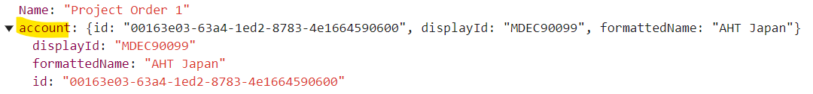
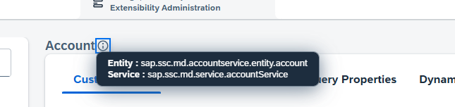

Based on use case, associations to other entity can be added to a particular entity. To acheive this, association to target entity needs to be specified in metadata.

Few examples are mentioned below: 

- __Add currencycode__<br>
Consider a scenario to show Estimated Revenue of project order.Estimated Revenue is Amount field which consists of value and currency codes respectively.

In Metadata, Estimated Revenue needs to be added like :

```json
{
  "name": "estimatedRevenue",
  "label": "Estimated Revenue",
  "dataType": "OBJECT",
  "dataFormat": "AMOUNT",
  "objectDefinition": [
    {
      "name": "content",
      "dataType": "NUMBER",
      "creatable": true,
      "updatable": true,
      "nullable": true,
      "sortable": true,
      "filterable": true,
      "searchable": false,
      "label": "Amount",
      "dataFormat": "DOUBLE"
    },
    {
      "name": "currencyCode",
      "dataType": "STRING",
      "creatable": true,
      "updatable": true,
      "nullable": true,
      "sortable": true,
      "filterable": true,
      "searchable": false,
      "label": "Currency",
      "dataFormat": "CODE",
      "keyType": "FOREIGN",
      "objectReference": {
        "targetAttribute": "code",
        "targetEntity": "sap.crm.i18nservice.entity.currency",
        "targetService": "sap.crm.service.i18nService",
        "associationType": "ASSOCIATION"
      }
    }
  ],
  "structReference": "sap.crm.common.struct.amount",
  "nullable": false,
  "creatable": true,
  "updatable": true,
  "filterable": true,
  "searchable": true
}
```

Here, for currecy codes, association to currency from i18 service is specified along with Target Entity.

-  __Add association to standard Account OVS__
Consider scenario, where customer(account) for a project order is fetched from SSCV2. And in Project order QC, customer is added via Account OVS. To do this, enhance metadata as per below , where again Association along with Target Entity needs to be specified.

```json
{
  "name": "account",
  "dataType": "OBJECT",
  "creatable": true,
  "updatable": true,
  "nullable": true,
  "sortable": false,
  "filterable": false,
  "searchable": false,
  "label": "Account",
  "objectDefinition": [
    {
      "name": "id",
      "dataType": "STRING",
      "creatable": true,
      "updatable": true,
      "nullable": true,
      "sortable": false,
      "filterable": false,
      "searchable": false,
      "label": "Account ID",
      "dataFormat": "UUID",
      "descriptionAttribute": "formattedName",
      "keyType": "FOREIGN",
      "objectReference": {
        "targetAttribute": "id",
        "targetEntity": "sap.ssc.md.accountservice.entity.account",
        "keyGroup": "account",
        "targetService": "sap.ssc.md.service.accountService",
        "associationType": "ASSOCIATION",
        "sourceAttribute": "account.id"
      },
      "analyticsRelevant": true,
      "searchWeightage": 1
    },
    {
      "name": "displayId",
      "dataType": "STRING",
      "creatable": false,
      "updatable": false,
      "nullable": true,
      "sortable": true,
      "filterable": true,
      "searchable": true,
      "label": "Account Display ID",
      "dataFormat": "ALPHANUMERIC",
      "objectReference": {
        "associationType": "REFERENCE",
        "targetAttribute": "displayId",
        "keyGroup": "account"
      },
      "searchWeightage": 1,
      "analyticsRelevant": true
    },
    {
      "name": "formattedName",
      "dataType": "STRING",
      "creatable": false,
      "updatable": false,
      "nullable": true,
      "sortable": true,
      "filterable": true,
      "searchable": true,
      "label": "Account Name",
      "objectReference": {
        "associationType": "REFERENCE",
        "targetAttribute": "formattedName",
        "keyGroup": "account"
      },
      "analyticsRelevant": true
    }
  ]
}
```
Response payload for such field will look like


Few points: 
- In this example, Account is object, which has id, displayId, and formatted Name(description/Account Name).
- Target Entity name can be taken from SSCV2 extensibility administration as shown below. 


### Add Enums as codelist
Enum based codelists are also supported.<br>
Example: Status of Project order can be set to Active or Inactive. Status field will get rendered as dropdown on UI.
Metadata will be -
```json
    {
          "name": "status",
          "label": "Status",
          "dataType": "STRING",
          "dataFormat": "CODE",
          "nullable": false,
          "creatable": true,
          "updatable": true,
          "filterable": true,
          "searchable": true,
          "enumOptions": [
            {
              "code": "ACTIVE",
              "description": "Active"
            },
            {
              "code": "INACTIVE",
              "description": "Inactive"
            }
          ],
          "searchWeightage": 1,
          "analyticsRelevant": true,
          "labelTextId": "ProjectOrderv11.status"
        }
       


