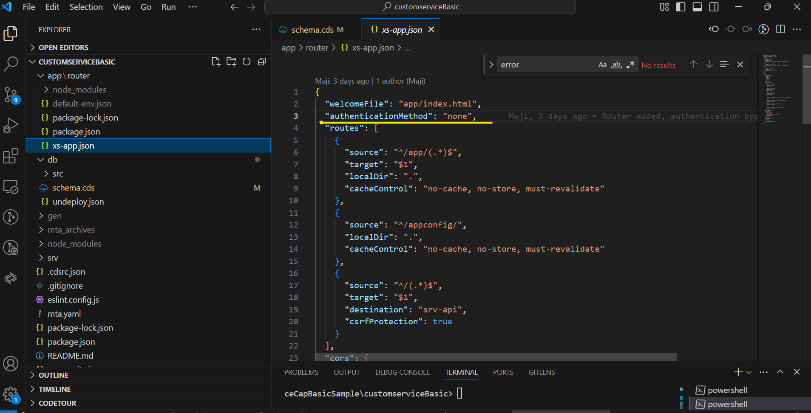
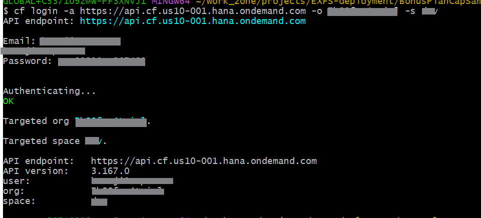
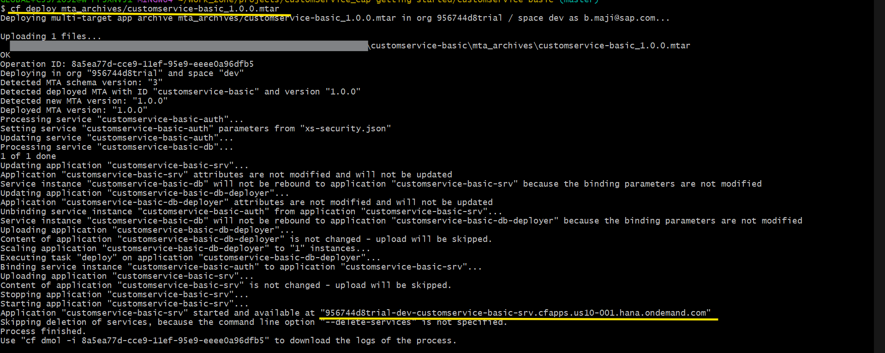
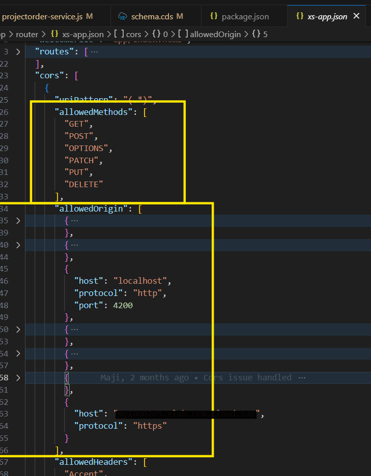

# Build and Deploy Application to Cloudfoundry on BTP
Download the source code.Once downloaded , deploy to BTP Cloud Foundry by following the steps given below.

There is also an official documentation by CAP on deployment to Cloud Foundry. Please check [here](https://cap.cloud.sap/docs/guides/deployment/to-cf) to refer the same.

## Prerequisities
Since we are deploying in BTP Cloud foundry, we need to have certain prerequisties such BTP account, hana DB - storing data, and other tools for deployment. Details are giveb below: 
* BTP account is required. For BTP Trial account please follow [SAP tutorial](https://developers.sap.com/tutorials/hcp-create-trial-account.html) 
* Create Hana database and have Tools subscription for HANA Database from [this](./create-hana-db.md) document. Refer [here](https://cap.cloud.sap/docs/guides/deployment/to-cf#_1-using-sap-hana-database) for official CAP document for HANA. 
* [Install](https://cap.cloud.sap/docs/guides/deployment/to-cf#mbt) Cloud MTA Build Tool from Capire documentation
* [Install](https://cap.cloud.sap/docs/guides/deployment/to-cf#cf-cli) Cloud Foundry CLI w/ MTA Plugins from Capire documentation

<!-- ## Add Hana for deployment
* Add Hana as per [CAP documentation] 

## Add XSUAA-Based Authentication for deployment
* Add XSUAA as per [CAP documentation](https://cap.cloud.sap/docs/guides/deployment/to-cf#_2-using-xsuaa-based-authentication) -->

## Add mock authentication
We are mocking the authentication in this sampe service to reduce complexity. For that, first we need to add XSUAA-Based authentication and in next step, we will mock it. Please follow steps below:
* Add XSUAA as per [CAP documentation](https://cap.cloud.sap/docs/guides/deployment/to-cf#_2-using-xsuaa-based-authentication)
* Go to package.json and change auth to "mocked" for production. Do the changes shown below for mocking.

## MTA setup
To deploy the application to Cloud Foundry, the mta.yaml file should be present and configured correctly.
* If mta file is not added to the application, follow [here](https://cap.cloud.sap/docs/guides/deployment/to-cf#add-mta-yaml) to create it.
* Above step will create the file with almost all the configuration needed.

## Build
Once the mta.yaml file created and configured correctly, following steps can be followed to build the application, which will create a deployable file with extension as "mtar".
* Update dependencies using **npm update --package-lock-only**. [Reference from Capire documentation](https://cap.cloud.sap/docs/guides/deployment/to-cf#freeze-dependencies)
* Build the application using **mbt build**. [Reference from Capire documentation](https://cap.cloud.sap/docs/guides/deployment/to-cf#assemble-with-mbt-build)
* Once successful, Build file will be created with "mtar" extention. In this case "customservice-basic_1.0.0.mtar"

## Login to CF and deploy
Once the build is created, the application can now be deployed to cloud foundry.
* Login the cloud foundry using:
**cf login -a [account] -o [subaccount] -s [space]**. The login to CF script output will look like below-

* Deploy using: **cf deploy [mtar file path]**. 
   * Deploy this sample using: **cf deploy mta_archives/cf deploy mta_archives/customservice-basic_1.0.0.mtar**
   * After successful deployment, terminal will look similar as shown below:
    
    The highlighted url is the entry point of the application.
* After completion of deployment the url can be seen in terminal. Please make note of this URL, as it would be needed in create Custom Service from SCCV2 settings.

### Handle CORS
To resolve the CORS issue when external service API URL(mentioned above) is called from SSCV2 UI, add “allowedMethods” and “allowedOrigin” in the “cors” section of xs-app.json present inside router, give host as SSCV2 system url.
Please check screenshot below for code reference - 

