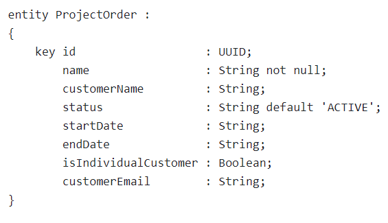

## Service
This is very basic CAP service for Project Order which captures minimum data. Entity is project order and attributes are shown below:

This is one root entity.

### Service API URL to get entity
SSCV2 expects the service API URL to be in particular format to fetch the root entity : `https://<application-url>/<service-name>/<entity-name>` 
  Considering the sample, the URL will look like- 
https://xyz.hana.ondemand.com/project-order-service/ProjectOrder

Here: 
  - https://xyz.hana.ondemand.com : is based URL where service is deployed 
  - project-order-service : is service name
  - ProjectOrder : entity
