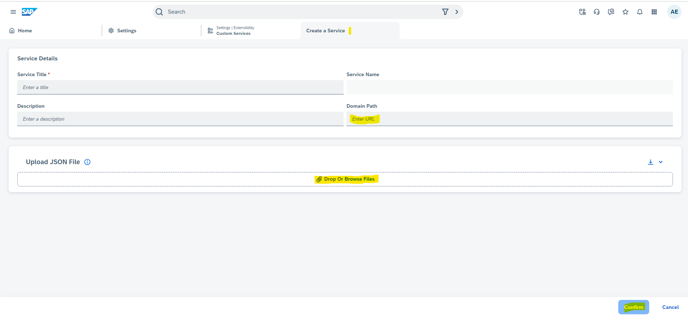
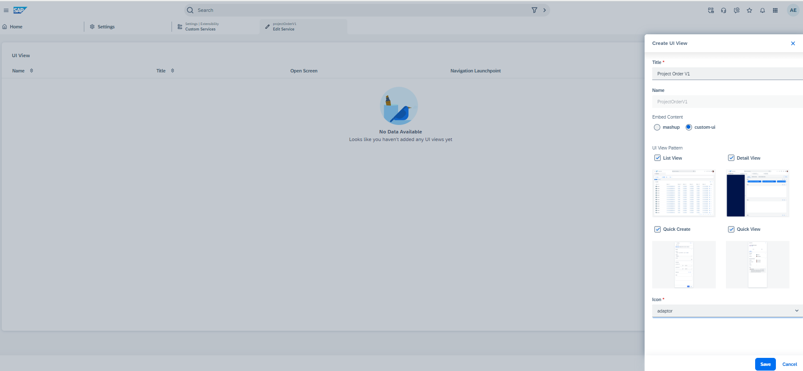

## Create Custom Service in SAP Sales and Service Cloud
Please follow the steps mentioned below to create custom service and generate UIs in SAP Sales and Service Cloud using this sample CAP service.  

 - Login with admin user in SAP Sales and Service Cloud and goto "Custom Services" settings. 
     
 - Click on "+" to create new Custom Service. Just enter the Domain Path - Base url where service is deployed.
       
 - Upload the metadata from previous step. Once uploaded UI will look like :
      
 - Once service is created, next step is to create Ui App. For that, click on "Design App" from actions column in customer services OWL.
    
 - From UiApp UI, click on "+" to create and select "custom ui" radio button as shown below. Give name - Project Order, which is Work center name. Select all the     patterns which are required for this usecase. Select the icon and click on save.
    
  - Once App is created, enable navigation launchpoint switch from list.
    
 - Once app is also created, assign the newly created service and app to the business role for user who need to see this project order UI.
    
    
 - Relogin with business user having service/app in previous step assigned.
 - Project Order Workcenter should be visible as shown below-
    
   

## UIs
 Once above mentioned steps are done, generated UIs can be launched from "Project Order" workcenter shown in image above.
- This is how object work list will look like
  
  ID column can be hidden via adaptation mode as shown below 
  
- Create Project Order by launching Quick Create from + icon. 
  
- Once Project order is created, Quick view can be opened by clicking on project order name.
   
- Details Ui can be opened by click on "open details" icon. This is as per standard navigation paradigm.
   
   Details UI -
   
 
 In Details, only header section has fields and data. There is no facet, as facet is created using child entities. This is explained in whats next section in main document.  
 
