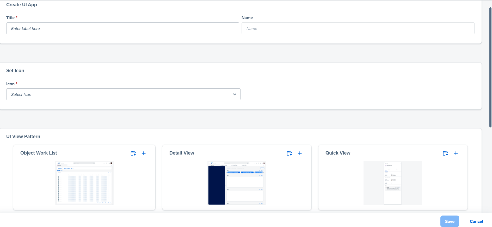
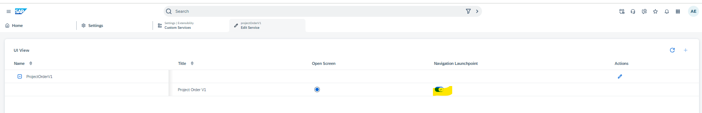

## Create Custom Service in SAP Sales and Service Cloud
Please follow the steps mentioned below to create custom service and generate UIs in SAP Sales and Service Cloud using this sample CAP service.  
 - Login with admin user in SAP Sales and Service Cloud and goto "Custom Services" settings.     
     
 - Click on "+" to create new Custom Service. select Entity Based Custom service.

   
    
 -  Enter the Domain Path - Base url where service is deployed.
       

    Please note : Download menu button provides options to download sample, template and current metadata respectively. Using "CAP File Conversion", metadata for a CAP service could be generated. For details, please refer [here](../Metadata.MD#cap-schema-to-metadata-json-conversion)
    
 - Upload the metadata mentioned in previous step. Once uploaded UI will look like :
      

   
 - Once service is created, next step is to create Ui App. For that, click on "Design App" from actions column in custom services OWL.
    
 - From UiApp UI, click on "+" to create. It will open creat view UI
      
   
 -   Give name - Project Order, which is Work center name. Fill all mandatory inputs needed. Select all the patterns which are required for this usecase. Select the + and click on save.

   

   In case any view contains mashup, that can also be selected. Which basically means, uiViews can either be gnerated custom ui or a mashup.

  - Once App is created, enable navigation launchpoint switch from list.
    
 - Once app is also created, assign the newly created service and app to the business role for user who need to see this project order UI.
    
    
 - Relogin with business user having service/app in previous step assigned.
 - Project Order Workcenter should be visible as shown below-
    
   

## UIs
 Once above mentioned steps are done, generated UIs can be launched from "Project Order" workcenter shown in image above.
- This is how object work list will look like
  
  ID column can be hidden via adaptation mode as shown below 
  
- Create Project Order by launching Quick Create from + icon. 
  
- Once Project order is created, Quick view can be opened by clicking on project order name.
   
- Details Ui can be opened by click on "open details" icon. This is as per standard navigation paradigm.
   
   Details UI -
   
 
 In Details, only header section has fields and data. There is no facet, as facet is created using child entities. This is explained in whats next section in main document.  
 
