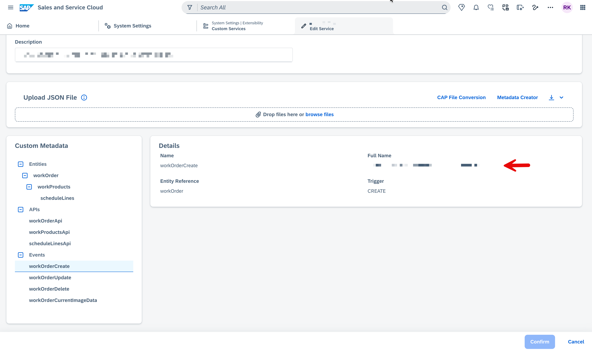

# Analytics Event Payload Reference - WorkOrder Service

## Architecture Overview

The system uses **CloudEvent** spec (v0.2) to emit analytics events via POST to:
`sap/c4c/api/v1/inbound-data-connector-service/events`

Two flows exist:
- **Data Export:** PLAN -> DATA (per record) -> SUMMARY
- **CUD Events:** Single DATA event per Create / Update / Delete operation

---

## Entity Hierarchy

```
WorkOrder
  |-- projectLead        (expanded from projectLeadId via EmployeeService)
  |-- estimatedRevenue   (composed from currencyCode + content)
  +-- workProducts[]
        |-- estimatedRevenue  (composed from currencyCode + content)
        +-- scheduleLines[]
```

---

## CloudEvent Envelope Structure

```json
{
  "id": "<UUID>",
  "subject": "<record ID or dataRequestId>",
  "type": "<event type string>",
  "specversion": "0.2",
  "source": "<SSC_TENANT_SOURCE_ID>",
  "time": "<ISO datetime>",
  "datacontenttype": "application/json",
  "data": { ... }
}
```

---

## Event Type Strings

The `type` field in every CloudEvent envelope maps to the `fullName` of the corresponding event registered in the SSC Custom Service.

**To find the correct value:** In the SSC tenant, go to **System Settings → Extensibility → Custom Services → Edit Service → Events**. Select the event and copy its **Full Name** shown in the details panel.



Example from UI: `customer.ssc.workOrderservice.event.workOrderCreate`

Use that value as the `type` in your CloudEvent payload.

### Event registry 

| Trigger | CloudEvent `type` |
|---------|-------------------|
| `CREATE` | `customer.ssc.workOrderservice.event.workOrderCreate` |
| `UPDATE` | `customer.ssc.workOrderservice.event.workOrderUpdate` |
| `DELETE` | `customer.ssc.workOrderservice.event.workOrderDelete` |
| `DATA_EXPORT_REQUEST` | `customer.ssc.workOrderservice.event.workOrderCurrentImageData` |

> **Note:** All three phases of a Data Export (PLAN, DATA, SUMMARY) use the same `type` — `workOrderCurrentImageData`. The phase is distinguished by the `data.type` field inside the payload (`"PLAN"`, `"DATA"`, or `"SUMMARY"`).

---

## Transformation Rules (Raw Entity -> Analytics Payload)

| Entity | Field(s) Removed / Transformed |
|--------|-------------------------------|
| **WorkOrder** | `projectLeadId` -> expanded to `projectLead { id, formattedName, displayId }` (omitted if null) |
| | `currencyCode` + `content` -> composed into `estimatedRevenue { currencyCode, content }` (omitted if null) |
| | `startDate` / `endDate` -> converted to ISO datetime strings |
| **WorkProduct** | `currencyCode` + `content` -> composed into `estimatedRevenue { currencyCode, content }` |
| | `workOrderId` stripped |
| **ScheduleLine** | `workProductId` stripped |
| | `createdAt` / `updatedAt` stripped |
| | `date` / `requestedEndDate` -> converted to ISO datetime strings |
| | `requestedQuantity` / `confirmedQuantity` -> cast to Number |

---

## CUD Event Data Rules

| Operation | beforeImage | currentImage |
|-----------|-------------|--------------|
| **Create** | absent | full snapshot of created record |
| **Update** | full snapshot BEFORE update | full snapshot AFTER update |
| **Delete** | full snapshot BEFORE deletion | absent |

---

## Sample Payloads

### 1. Data Export - PLAN Event

```json
{
  "id": "11111111-aaaa-bbbb-cccc-dddddddddddd",
  "subject": "req-00001111-2222-3333-4444-555566667777",
  "type": "customer.ssc.workorderservice.event.workOrderCurrentImageData",
  "specversion": "0.2",
  "source": "65003404b3bd0d2a0e8c3586",
  "time": "2026-03-26T08:00:00.000Z",
  "datacontenttype": "application/json",
  "data": {
    "dataRequestId": "req-00001111-2222-3333-4444-555566667777",
    "entityFullName": "customer.ssc.workorderservice.entity.workOrder",
    "serviceFullName": "customer.ssc.service.workorderservice",
    "type": "PLAN",
    "count": 42
  }
}
```

---

### 2. Data Export - DATA Event (one per record)

```json
{
  "id": "22222222-bbbb-cccc-dddd-eeeeeeeeeeee",
  "subject": "f47ac10b-58cc-4372-a567-0e02b2c3d479",
  "type": "customer.ssc.workorderservice.event.workOrderCurrentImageData",
  "specversion": "0.2",
  "source": "65003404b3bd0d2a0e8c3586",
  "time": "2026-03-26T08:00:05.000Z",
  "datacontenttype": "application/json",
  "data": {
    "dataRequestId": "req-00001111-2222-3333-4444-555566667777",
    "entityFullName": "customer.ssc.workorderservice.entity.workOrder",
    "serviceFullName": "customer.ssc.service.workorderservice",
    "type": "DATA",
    "currentImage": {
      "id": "f47ac10b-58cc-4372-a567-0e02b2c3d479",
      "status": "ACTIVE",
      "startDate": "2026-04-01T00:00:00.000Z",
      "endDate": "2026-12-31T00:00:00.000Z",
      "orderName": "Cloud Migration Project",
      "numberOfSubscriptions": "5",
      "displayId": "WO-001",
      "caseDisplayId": "CS-2026-0042",
      "Customer": "Acme Corporation",
      "createdAt": "2026-03-26T10:15:29.000Z",
      "updatedAt": "2026-03-26T10:15:29.000Z",
      "estimatedRevenue": {
        "currencyCode": "USD",
        "content": 150000
      },
      "projectLead": {
        "id": "e12a34b5-6789-0abc-def1-234567890abc",
        "formattedName": "John Smith",
        "displayId": "EMP-1001"
      },

      "workProducts": [
        {
          "id": "c23d45e6-7890-1bcd-ef23-456789012bcd",
          "workProductId": "WP-101",
          "workProductName": "Data Migration Service",
          "customizationDetails": "Full ETL pipeline setup",
          "quantity": 1,
          "productCategory": "Services",
          "completionPercentage": 0,
          "productTypeCode": "SVC",
          "status": "In Progress",
          "createdAt": "2026-03-26T10:15:29.000Z",
          "updatedAt": "2026-03-26T10:15:29.000Z",
          "estimatedRevenue": {
            "currencyCode": "USD",
            "content": 75000
          },
          "scheduleLines": [
            {
              "id": "d34e56f7-8901-2cde-f345-678901234cde",
              "displayId": "SL-001",
              "scheduleLineName": "Phase 1 Delivery",
              "date": "2026-06-01T00:00:00.000Z",
              "requestedQuantity": 1,
              "confirmedQuantity": 1,
              "requestedEndDate": "2026-06-30T00:00:00.000Z",
              "status": "Open"
            }
          ]
        }
      ]
    }
  }
}
```

---

### 3. Data Export - SUMMARY Event (Success)

```json
{
  "id": "33333333-cccc-dddd-eeee-ffffffffffff",
  "subject": "req-00001111-2222-3333-4444-555566667777",
  "type": "customer.ssc.workorderservice.event.workOrderCurrentImageData",
  "specversion": "0.2",
  "source": "65003404b3bd0d2a0e8c3586",
  "time": "2026-03-26T08:05:00.000Z",
  "datacontenttype": "application/json",
  "data": {
    "dataRequestId": "req-00001111-2222-3333-4444-555566667777",
    "entityFullName": "customer.ssc.workorderservice.entity.workOrder",
    "serviceFullName": "customer.ssc.service.workorderservice",
    "type": "SUMMARY",
    "status": "SUCCESS",
    "count": 42
  }
}
```

---

### 4. Data Export - SUMMARY Event (Aborted)

```json
{
  "id": "44444444-dddd-eeee-ffff-aaaaaaaaaaaa",
  "subject": "req-00001111-2222-3333-4444-555566667777",
  "type": "customer.ssc.workorderservice.event.workOrderCurrentImageData",
  "specversion": "0.2",
  "source": "65003404b3bd0d2a0e8c3586",
  "time": "2026-03-26T08:03:00.000Z",
  "datacontenttype": "application/json",
  "data": {
    "dataRequestId": "req-00001111-2222-3333-4444-555566667777",
    "entityFullName": "customer.ssc.workorderservice.entity.workOrder",
    "serviceFullName": "customer.ssc.service.workorderservice",
    "type": "SUMMARY",
    "status": "ABORTED",
    "count": 0,
    "errorMessage": "Connection timeout while fetching records",
    "errorCode": "DATA_EXPORT_ERROR"
  }
}
```

---

### 5. CUD CREATE Event

```json
{
  "id": "a1b2c3d4-e5f6-7890-abcd-ef1234567890",
  "subject": "f47ac10b-58cc-4372-a567-0e02b2c3d479",
  "type": "customer.ssc.workorderservice.event.workOrderCreate",
  "specversion": "0.2",
  "source": "65003404b3bd0d2a0e8c3586",
  "time": "2026-03-26T10:15:30.000Z",
  "datacontenttype": "application/json",
  "data": {
    "dataRequestId": "9f8e7d6c-5b4a-3210-fedc-ba0987654321",
    "entityFullName": "customer.ssc.workorderservice.entity.workOrder",
    "serviceFullName": "customer.ssc.service.workorderservice",
    "type": "DATA",
    "currentImage": {
      "id": "f47ac10b-58cc-4372-a567-0e02b2c3d479",
      "status": "ACTIVE",
      "startDate": "2026-04-01T00:00:00.000Z",
      "endDate": "2026-12-31T00:00:00.000Z",
      "orderName": "Cloud Migration Project",
      "numberOfSubscriptions": "5",
      "displayId": "WO-001",
      "caseDisplayId": "CS-2026-0042",
      "Customer": "Acme Corporation",
      "createdAt": "2026-03-26T10:15:29.000Z",
      "updatedAt": "2026-03-26T10:15:29.000Z",
      "estimatedRevenue": {
        "currencyCode": "USD",
        "content": 150000
      },
      "projectLead": {
        "id": "e12a34b5-6789-0abc-def1-234567890abc",
        "formattedName": "John Smith",
        "displayId": "EMP-1001"
      },

      "workProducts": [
        {
          "id": "c23d45e6-7890-1bcd-ef23-456789012bcd",
          "workProductId": "WP-101",
          "workProductName": "Data Migration Service",
          "customizationDetails": "Full ETL pipeline setup",
          "quantity": 1,
          "productCategory": "Services",
          "completionPercentage": 0,
          "productTypeCode": "SVC",
          "status": "In Progress",
          "createdAt": "2026-03-26T10:15:29.000Z",
          "updatedAt": "2026-03-26T10:15:29.000Z",
          "estimatedRevenue": {
            "currencyCode": "USD",
            "content": 75000
          },
          "scheduleLines": [
            {
              "id": "d34e56f7-8901-2cde-f345-678901234cde",
              "displayId": "SL-001",
              "scheduleLineName": "Phase 1 Delivery",
              "date": "2026-06-01T00:00:00.000Z",
              "requestedQuantity": 1,
              "confirmedQuantity": 1,
              "requestedEndDate": "2026-06-30T00:00:00.000Z",
              "status": "Open"
            }
          ]
        }
      ]
    }
  }
}
```

---

### 6. CUD UPDATE Event

```json
{
  "id": "b2c3d4e5-f6a7-8901-bcde-f23456789012",
  "subject": "f47ac10b-58cc-4372-a567-0e02b2c3d479",
  "type": "customer.ssc.workorderservice.event.workOrderUpdate",
  "specversion": "0.2",
  "source": "65003404b3bd0d2a0e8c3586",
  "time": "2026-03-26T14:30:00.000Z",
  "datacontenttype": "application/json",
  "data": {
    "dataRequestId": "af1e2d3c-4b5a-6789-0fed-cba987654321",
    "entityFullName": "customer.ssc.workorderservice.entity.workOrder",
    "serviceFullName": "customer.ssc.service.workorderservice",
    "type": "DATA",
    "beforeImage": {
      "id": "f47ac10b-58cc-4372-a567-0e02b2c3d479",
      "status": "ACTIVE",
      "startDate": "2026-04-01T00:00:00.000Z",
      "endDate": "2026-12-31T00:00:00.000Z",
      "orderName": "Cloud Migration Project",
      "numberOfSubscriptions": "5",
      "displayId": "WO-001",
      "caseDisplayId": "CS-2026-0042",
      "Customer": "Acme Corporation",
      "createdAt": "2026-03-26T10:15:29.000Z",
      "updatedAt": "2026-03-26T10:15:29.000Z",
      "estimatedRevenue": {
        "currencyCode": "USD",
        "content": 150000
      },
      "projectLead": {
        "id": "e12a34b5-6789-0abc-def1-234567890abc",
        "formattedName": "John Smith",
        "displayId": "EMP-1001"
      },

      "workProducts": [
        {
          "id": "c23d45e6-7890-1bcd-ef23-456789012bcd",
          "workProductId": "WP-101",
          "workProductName": "Data Migration Service",
          "customizationDetails": "Full ETL pipeline setup",
          "quantity": 1,
          "productCategory": "Services",
          "completionPercentage": 0,
          "productTypeCode": "SVC",
          "status": "In Progress",
          "createdAt": "2026-03-26T10:15:29.000Z",
          "updatedAt": "2026-03-26T10:15:29.000Z",
          "estimatedRevenue": {
            "currencyCode": "USD",
            "content": 75000
          },
          "scheduleLines": [
            {
              "id": "d34e56f7-8901-2cde-f345-678901234cde",
              "displayId": "SL-001",
              "scheduleLineName": "Phase 1 Delivery",
              "date": "2026-06-01T00:00:00.000Z",
              "requestedQuantity": 1,
              "confirmedQuantity": 1,
              "requestedEndDate": "2026-06-30T00:00:00.000Z",
              "status": "Open"
            }
          ]
        }
      ]
    },
    "currentImage": {
      "id": "f47ac10b-58cc-4372-a567-0e02b2c3d479",
      "status": "INACTIVE",
      "startDate": "2026-04-01T00:00:00.000Z",
      "endDate": "2027-03-31T00:00:00.000Z",
      "orderName": "Cloud Migration Project - Extended",
      "numberOfSubscriptions": "8",
      "displayId": "WO-001",
      "caseDisplayId": "CS-2026-0042",
      "Customer": "Acme Corporation",
      "createdAt": "2026-03-26T10:15:29.000Z",
      "updatedAt": "2026-03-26T14:29:58.000Z",
      "estimatedRevenue": {
        "currencyCode": "USD",
        "content": 250000
      },
      "projectLead": {
        "id": "e12a34b5-6789-0abc-def1-234567890abc",
        "formattedName": "John Smith",
        "displayId": "EMP-1001"
      },

      "workProducts": [
        {
          "id": "c23d45e6-7890-1bcd-ef23-456789012bcd",
          "workProductId": "WP-101",
          "workProductName": "Data Migration Service",
          "customizationDetails": "Full ETL pipeline setup",
          "quantity": 1,
          "productCategory": "Services",
          "completionPercentage": 40,
          "productTypeCode": "SVC",
          "status": "In Progress",
          "createdAt": "2026-03-26T10:15:29.000Z",
          "updatedAt": "2026-03-26T14:29:58.000Z",
          "estimatedRevenue": {
            "currencyCode": "USD",
            "content": 100000
          },
          "scheduleLines": [
            {
              "id": "d34e56f7-8901-2cde-f345-678901234cde",
              "displayId": "SL-001",
              "scheduleLineName": "Phase 1 Delivery",
              "date": "2026-06-01T00:00:00.000Z",
              "requestedQuantity": 1,
              "confirmedQuantity": 1,
              "requestedEndDate": "2026-06-30T00:00:00.000Z",
              "status": "Completed"
            },
            {
              "id": "e45f67a8-9012-3def-a456-789012345def",
              "displayId": "SL-002",
              "scheduleLineName": "Phase 2 Delivery",
              "date": "2026-09-01T00:00:00.000Z",
              "requestedQuantity": 1,
              "requestedEndDate": "2026-09-30T00:00:00.000Z",
              "status": "Open"
            }
          ]
        }
      ]
    }
  }
}
```

**What changed in this Update example:** status (ACTIVE->INACTIVE), endDate extended, orderName updated, numberOfSubscriptions (5->8), estimatedRevenue (150k->250k), workProduct completionPercentage (0->40), workProduct estimatedRevenue (75k->100k), scheduleLine SL-001 status (Open->Completed), new scheduleLine SL-002 added.

---

### 7. CUD DELETE Event

```json
{
  "id": "c3d4e5f6-a7b8-9012-cdef-345678901234",
  "subject": "f47ac10b-58cc-4372-a567-0e02b2c3d479",
  "type": "customer.ssc.workorderservice.event.workOrderDelete",
  "specversion": "0.2",
  "source": "65003404b3bd0d2a0e8c3586",
  "time": "2026-03-27T09:00:00.000Z",
  "datacontenttype": "application/json",
  "data": {
    "dataRequestId": "bf2e3d4c-5a6b-7890-1edc-ba0987654321",
    "entityFullName": "customer.ssc.workorderservice.entity.workOrder",
    "serviceFullName": "customer.ssc.service.workorderservice",
    "type": "DATA",
    "beforeImage": {
      "id": "f47ac10b-58cc-4372-a567-0e02b2c3d479",
      "status": "INACTIVE",
      "startDate": "2026-04-01T00:00:00.000Z",
      "endDate": "2027-03-31T00:00:00.000Z",
      "orderName": "Cloud Migration Project - Extended",
      "numberOfSubscriptions": 8,
      "displayId": "WO-001",
      "caseDisplayId": "CS-2026-0042",
      "Customer": "Acme Corporation",
      "createdAt": "2026-03-26T10:15:29.000Z",
      "updatedAt": "2026-03-26T14:29:58.000Z",
      "estimatedRevenue": {
        "currencyCode": "USD",
        "content": 250000
      },
      "projectLead": {
        "id": "e12a34b5-6789-0abc-def1-234567890abc",
        "formattedName": "John Smith",
        "displayId": "EMP-1001"
      },
      "workProducts": [
        {
          "id": "c23d45e6-7890-1bcd-ef23-456789012bcd",
          "workProductId": "WP-101",
          "workProductName": "Data Migration Service",
          "customizationDetails": "Full ETL pipeline setup",
          "quantity": 1,
          "productCategory": "Services",
          "completionPercentage": 40,
          "productTypeCode": "SVC",
          "status": "In Progress",
          "createdAt": "2026-03-26T10:15:29.000Z",
          "updatedAt": "2026-03-26T14:29:58.000Z",
          "estimatedRevenue": {
            "currencyCode": "USD",
            "content": 100000
          },
          "scheduleLines": [
            {
              "id": "d34e56f7-8901-2cde-f345-678901234cde",
              "displayId": "SL-001",
              "scheduleLineName": "Phase 1 Delivery",
              "date": "2026-06-01T00:00:00.000Z",
              "requestedQuantity": 1,
              "confirmedQuantity": 1,
              "requestedEndDate": "2026-06-30T00:00:00.000Z",
              "status": "Completed"
            }
          ]
        }
      ]
    }
  }
}
```

**Note:** Delete events carry only `beforeImage` — the full snapshot of the record as it existed immediately before deletion. There is no `currentImage`.

---

## CUD Trigger Points

| Trigger | Operation | What fires |
|---------|-----------|-----------|
| WorkOrder created | Create | CUD CREATE with currentImage only |
| WorkOrder updated | Update | CUD UPDATE with beforeImage + currentImage |
| WorkOrder deleted | Delete | CUD DELETE with beforeImage only |
| WorkProduct created/updated/deleted | Update | CUD UPDATE on **parent WorkOrder** (beforeImage + currentImage) |
| ScheduleLine created/updated/deleted | Update | CUD UPDATE on **parent WorkOrder** (beforeImage + currentImage) |

---

