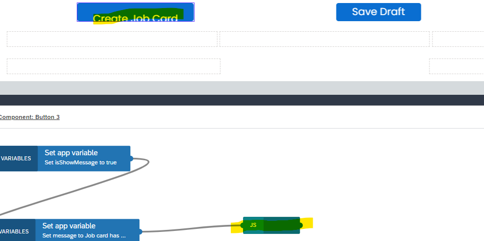
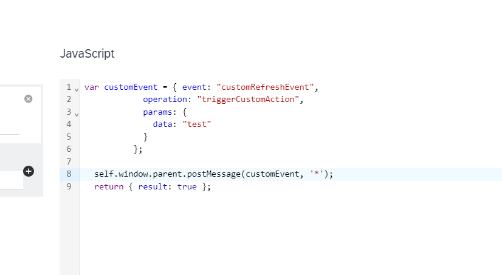
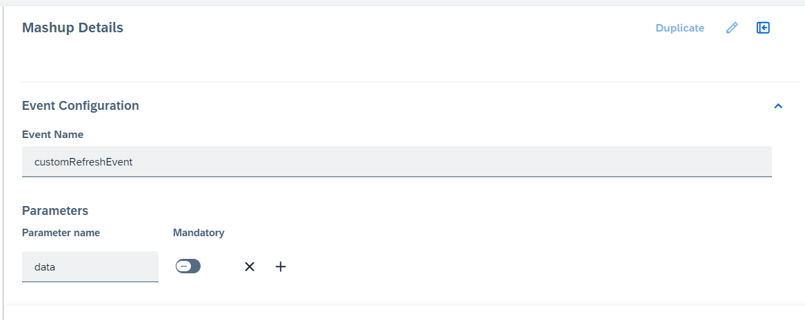
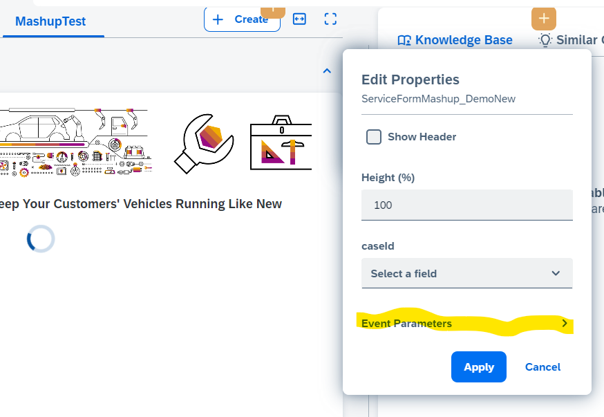

# Triggering standard SSCV2 event from mashup
SAP Sales and Service Cloud V2 offers the capability to trigger standard events from mashups. To fully leverage this feature, the following adjustments are necessary:
   1) Mashup Application(External) – Implement a window postmessage function to trigger the custom event along with the relevant event parameters.
   2) Mashup Authoring(SSCV2) – Configure the custom event and define its parameters within the specific mashup.
   3) Adaptation(SSCV2) – Link the custom event to the corresponding standard event, ensuring proper binding of event parameters.

   ## Use case and implementation details
  Consider the following use case in this sample vehicle service scenario- When a service form and job card are created, their respective IDs are updated in the Case UI through an API call from the backend service. Additionally, the case status is updated. However, while these changes are successfully reflected at the backend, they do not appear immediately on the UI, requiring a manual refresh to display the updates.

   This is not an ideal business flow, as the UI should display real-time updates. Let’s explore in below sections on how we can address this use case and identify the necessary changes. 

 #### Mashup Application(External) – Implement a window postmessage function to trigger the custom event along with the relevant event parameters.
   The mashups for service Form, jobcard and portal are implemented using SAP Build. Once jobcard is created from service form, we will raise postmessage with custom event details as parameter. Todo this, drag javascript block in SAP Build, and write JS code as below:
   
*var customEvent = {	event: "customRefreshEvent",* 
						*params: {*
							*data: "test"*
						*}*
					*};*
 
*self.window.parent.postMessage(customEvent, '*');* 
 *return { result: true };*    

<b>Event:</b>
The event is a custom-defined action with any name, and it will be configured within the Mashup Authoring feature in SSCV2.

<b>Params:</b>
This parameter is optional. It contains information that will be passed to SSCV2 when the event is triggered. In our specific use case, params are not required since the event is solely intended to trigger a refresh. However, for completeness and to provide more information, it has been mentioned here.

<b>self.window:</b>
In SAP Build, the self.window object represents the global window context.

<b>Return:</b>
SAP Build requires a return statement at the end of the JavaScript code. "Result" should be returned here. For our refresh, we are just returning true.

Please refer the images below for more details on where and how JS code is added in SAP Build  

#### Mashup Authoring(SSCV2) – Configure the custom event and define its parameters within the specific mashup.
In SSCV2 application, goto Mashup Authoring settings. Create mashup and add event configuration.For our use case, specify the event name as "customRefreshEvent". While parameters can also be added, they are not required for our refresh scenario.
Please refer the screenshot below for more details:

*Please Note - Event configuration in mashup authoring is based on feature flag. Please raise customer incident to get it enabled for your tenant*

#### Adaptation(SSCV2) – Link the custom event to the corresponding standard event, ensuring proper binding of event parameters.
When adding the mashup in SSCV2, bind the custom event to a standard event that is exposed. Parameter binding is also supported.
For our refresh use case, we have bound the custom event "customRefreshEvent" to the standard exposed refresh event ("").

Image below shows "Event Parameters" option while adding mashup. Drilling down will give option to bind custom event with standard event along with parameters

Once the above configuration is complete, the Case UI will automatically refresh upon creating a job card. This ensures that the job card ID and case status are updated promptly.

